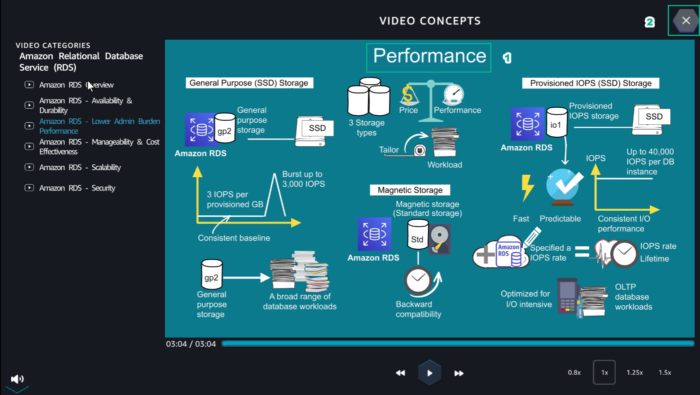

10.1 Learn
=================================

INFO!

Learn helps players to understand more theory about

1. In the Learn interface

- Read step 1 of Diagram Steps

- Select Amazon RDS Overview

2. In the VIDEO CONCEPTS interface

- Watch video Amazon RDS Overview

- Select X to exit

3. In the Learn interface

- Read step 2 of Diagram Steps

- Select Amazon RDS - Lower Admin Burden Performance

.. image:: pictures/E3.png
   :align: center
   :width: 700px

4. In the VIDEO CONCEPTS interface

- Watch the video Amazon RDS - Lower Admin Burden Performance

- Select X to exit

5. In the Learn interface

- Read step 3 of Diagram Steps

- Select Amazon RDS - Availability & Durability

.. image:: pictures/E5.png
   :align: center
   :width: 700px

6. In the VIDEO CONCEPT interface

- Watch video Amazon RDS - Availability & Durability

- Select X to exit

.. image:: pictures/E6.png
   :align: center
   :width: 700px

7. In the Learn interface

- Read step 4 of Diagram Steps

- Select Amazon RDS - Availability & Durability

.. image:: pictures/E7.png
   :align: center
   :width: 700px

8. In the VIDEO CONCEPTS interface

- Watch video Amazon RDS - Availability & Durability

- Select X to exit

9. In the Learn interface

- Read step 5 of Diagram Steps

- Select Amazon RDS - Scalability

10. In the VIDEO CONCEPT interface

- Watch video Amazon RDS - Scalability

- Select X to exit

.. image:: pictures/E10.png
   :align: center
   :width: 700px
