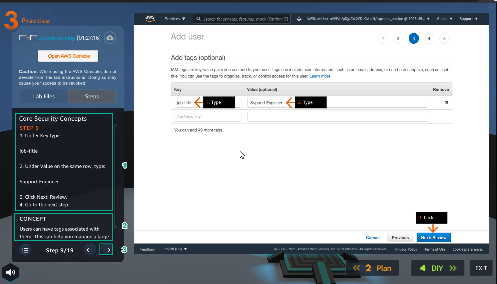
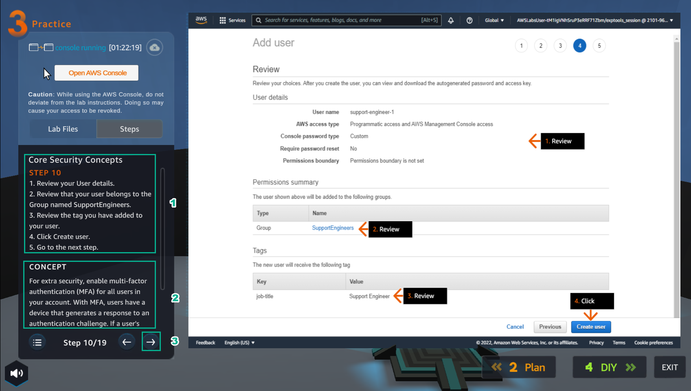
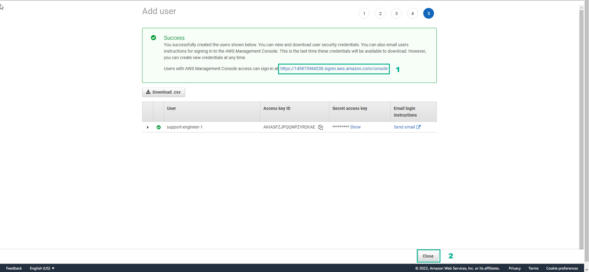
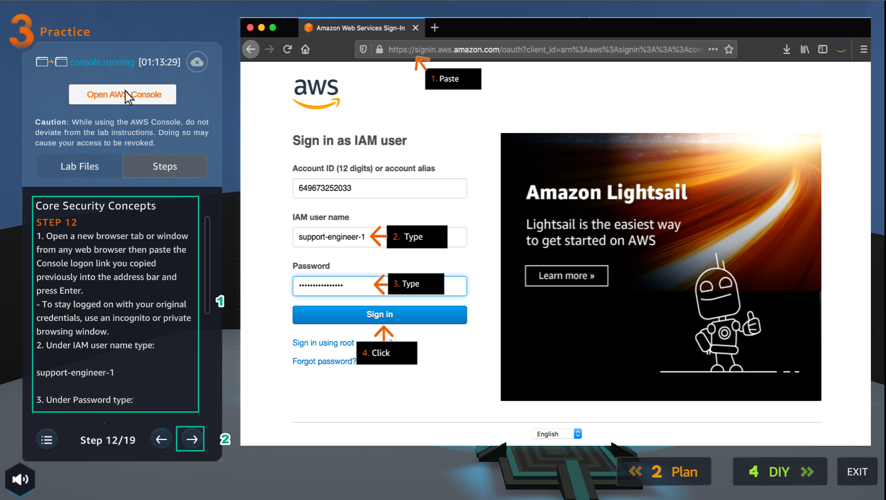
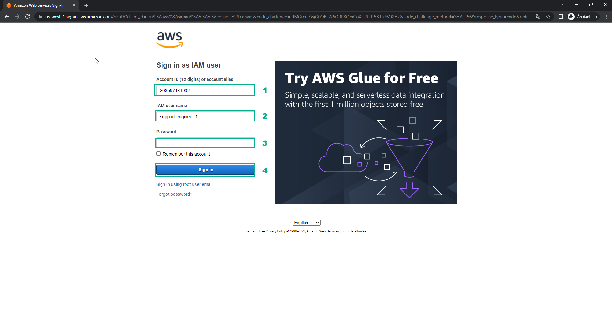
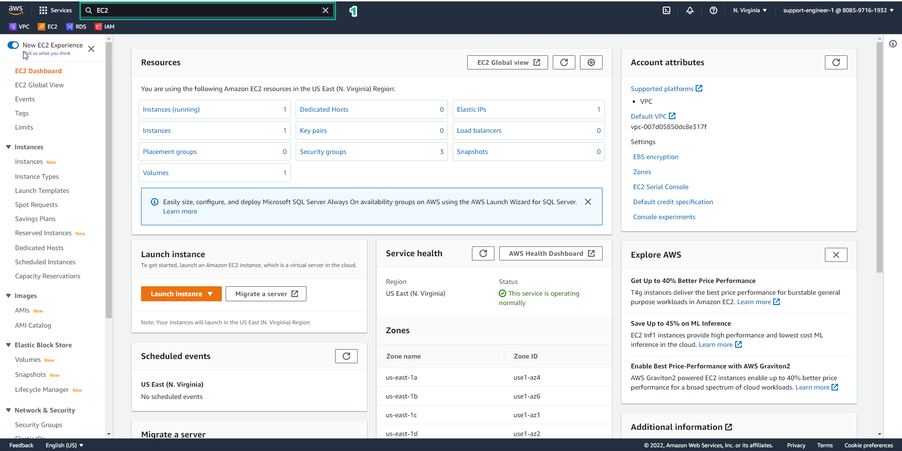
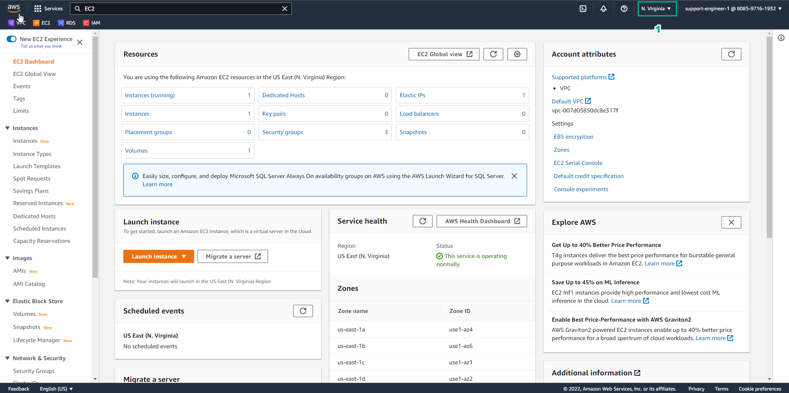
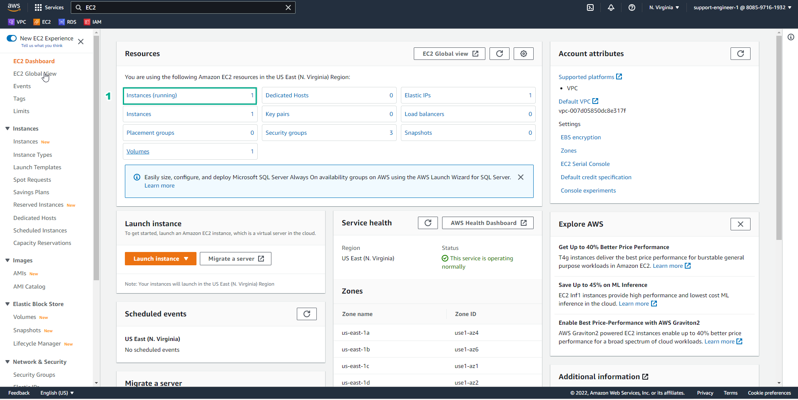

11.3 Practice
=================================

INFO!
After watching Plan, the player prepares for Practice

1. In the Practice interface

- Read step 1 of Core Security Concepts

- Read CONCEPT

- Select START LAB

- Select the arrow to the right to see the next steps

.. image:: pictures/H1.png
   :align: center
   :width: 700px

2. In the Practice interface

- Read step 2 of Core Security Concepts

- Read CONCEPT

- Select Open AWS Console

- Select the arrow to the right to see the next steps

.. image:: pictures/H2.png
   :align: center
   :width: 700px

3. In the AWS Console interface

- Find IAM

- Select IAM

.. image:: pictures/H3.png
   :align: center
   :width: 700px

4. In the Practice interface

- Read step 3 of Core Security Concepts

- Read CONCEPT

- Select the arrow to the right to see the next steps

.. image:: pictures/H4.png
   :align: center
   :width: 700px

5. In the IAM interface

- Select Use groups

- Select Create group

.. image:: pictures/H5.png
   :align: center
   :width: 700px

6. In the Practice interface

- Read step 4 of Cloud Economics

- Read CONCEPT

- Select the arrow to the right to see the next steps

7. In the My Estimate interface

- Select Add group

.. image:: pictures/H7.png
   :align: center
   :width: 700px

8. In the Practice interface

- Read step 5 of Cloud Economics

- Read CONCEPT

- Select the arrow to the right to see the next steps

.. image:: pictures/H8.png
   :align: center
   :width: 700px

9. In the Add group interface

- In Group settings, Group name field enter Web Servers

- Then, select Add group

.. image:: pictures/H9.png
   :align: center
   :width: 700px

10. In the Practice interface

- Read step 6 of Cloud Economics

- Read CONCEPT

- Select the arrow to the right to see the next steps

.. image:: pictures/H10.png
   :align: center
   :width: 700px

11. In the Web Server interface

- Select Add service

.. image:: pictures/H11.png
   :align: center
   :width: 700px

12. In the Practice interface

- Read step 7 of Cloud Economics

- Read CONCEPT

- Select the arrow to the right to see the next steps

.. image:: pictures/H12.png
   :align: center
   :width: 700px

13. In the Add service interface

- Find EC2

- Select Configure

14. In the Practice interface

- Read step 8 of Cloud Economics

- Read CONCEPT

- Select the arrow to the right to see the next steps

.. image:: pictures/H14.png
   :align: center
   :width: 700px

15. In the Configure Amazon EC2 interface

- In Description, enter Web Server Estimate

- Region, select US East (N. Virginia)

- Select Advanced estimate

16. In the Practice interface

- Read step 9 of Cloud Economics

- Read CONCEPT

- Select the arrow to the right to see the next steps

17. In EC2 instance specifications

- Operating system, select Linux

- Workload, select Daily spike traffic

- Workload days, choose the days of the week

18. In the Practice interface

- Read step 10 of Cloud Economics

- Read CONCEPT

- Select the arrow to the right to see the next steps

19. In Daily spike pattern

- Baseline, enter 2

- Peak, enter 4

- Duration of peak, enter 8 and 0

20. In the Practice interface

- Read step 11 of Cloud Economics

- Read CONCEPT

- Select the arrow to the right to see the next steps

.. image:: pictures/H20.png
   :align: center
   :width: 700px

21.In EC2 Instances

- Enter 2

- Select 4 GiB

- Chon5 Any Network Performance

- Select t2.medium

22. In the Practice interface

- Read step 12 of Cloud Economics

- Read CONCEPT

- Select the arrow to the right to see the next steps

23. In Pricing strategy

- Select On-Demand

- Select Show calculations

- Select estimated workload hours

24. In the Practice interface

- Read step 13 of Cloud Economics

- Read CONCEPT

- Select the arrow to the right to see the next steps

.. image:: pictures/H24.png
   :align: center
   :width: 700px

25. View Estimated workload hours

.. image:: pictures/H25.png
   :align: center
   :width: 700px

26. In the Practice interface

- Read step 14 of Cloud Economics

- Read CONCEPT

- Select the arrow to the right to see the next steps

27. In Amazon Elastic Block Storage (EBS)

- Storage for each EC2 instance, select General Purpose SSD (gp2)

- Storage amount, enter 30

- Snapshot Frequency, select Weekly

- Amount changed per snapshot, select 1

.. image:: pictures/H27.png
   :align: center
   :width: 700px

28. In the Practice interface

- Read step 15 of Cloud Economics

- Read CONCEPT

- Select the arrow to the right to see the next steps

29. In Data Transfer

- Select Internet (free), enter 1, select TB per month

- In Outbound Data Transfer, select Internet($0.05 - $0.09 per GB), enter 100, select GB per month

- Select Show calculations

30. In the Practice interface

- Read step 16 of Cloud Economics

- Read CONCEPT

- Select the arrow to the right to see the next steps

31. Review and select Add to my estimate

.. image:: pictures/H31.png
   :align: center
   :width: 700px

32. In the Practice interface

- Read step 17 of Cloud Economics

- Read CONCEPT

- Select the arrow to the right to see the next steps

33. Result interface Web Servers, select Share

.. image:: pictures/H33.png
   :align: center
   :width: 700px

34. In the Practice interface

- Read step 18 of Cloud Economics

- Read CONCEPT

- Select the arrow to the right to see the next steps

.. image:: pictures/n34.png
   :align: center
   :width: 700px

35. In the Practice interface

- Read step 18 of Core Security Concepts

- Read CONCEPT

- Select the arrow to the right to see the next steps

.. image:: pictures/H35.png
   :align: center
   :width: 700px

36. In the Practice interface

- Read step 19 of Cloud Economics

- Read CONCEPT

- Select the arrow to the right to see the next steps

.. image:: pictures/H36.png
   :align: center
   :width: 700px

37. Lab results

.. image:: pictures/H37.png
   :align: center
   :width: 700px

38. Congratulations to the player on completing the lab

.. image:: pictures/H38.png
   :align: center
   :width: 700px
