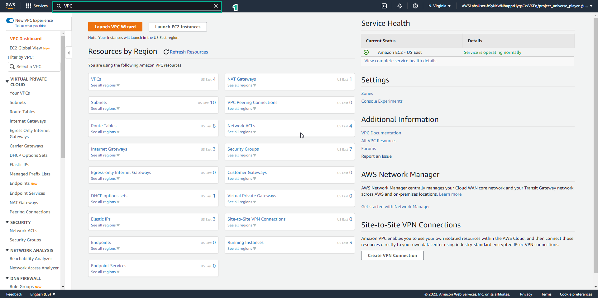
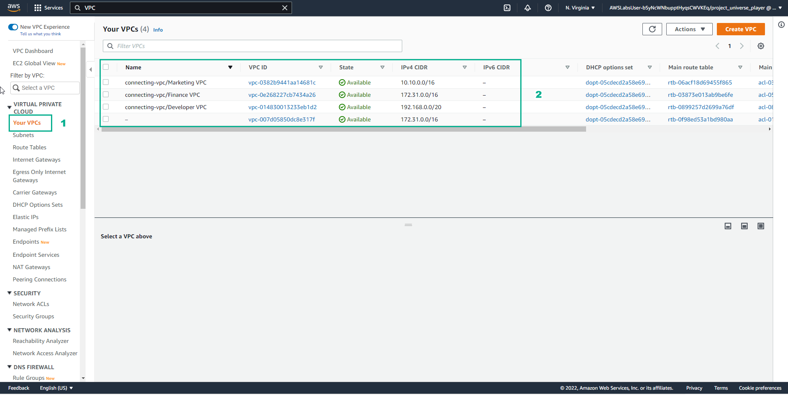

11.3 Practice
=================================

INFO!

After watching Plan, the player prepares for Practice

1. Interface Practice

- Read step 1 of Connecting VPCs

- Read CONCEPT

- Select START LAB

- Select the arrow to the right to go to the next step

.. image:: pictures/D2.png
   :align: center
   :width: 700px

2. In the Practice interface

- Read step 2 of Connecting VPCs

- Read CONCEPT

- Select Open AWS Console

- Select the arrow to the right to see the next step

.. image:: pictures/D3.png
   :align: center
   :width: 700px

3. In the AWS Console interface

- Find VPC

- Select VPC

4. In the Practice interface

- Read step 3 of Connecting VPCs

- Read CONCEPT

- Select the arrow to the right to see the next step

.. image:: pictures/D5.png
   :align: center
   :width: 700px

5. Interface VPCs

- Select Your VPCs

- View VPCs: Marketing, Finance and Developer

6. In the Practice interface

- Read step 4 of Connecting VPCs

- Select the arrow to the right to see the next step

.. image:: pictures/D7.png
   :align: center
   :width: 700px

7. In the AWS Console interface

- Find EC2

- Select EC2

.. image:: pictures/D8.png
   :align: center
   :width: 700px

8. In the Practice interface

- Read step 5 of Connecting VPCs

- Select the arrow to the right to see the next steps

.. image:: pictures/D9.png
   :align: center
   :width: 700px

9. In the EC2 interface

- Select Instances (running)

.. image:: pictures/D10.png
   :align: center
   :width: 700px

10. In the Practice interface

- Read step 6 of Connecting VPCs

- Read CONCEPT

- Select the right arrow to see the next steps

.. image:: pictures/D11.png
   :align: center
   :width: 700px

11. In the EC2 interface

- Select Financial Services Server

- Select Details to see details Financial Services Server

- View Subnet ID of FinancePrivateSubnet

.. image:: pictures/D12.png
   :align: center
   :width: 700px

12. In the Practice interface

- Read step 7 of Connecting VPCs

- Select CONCEPT

- Select the arrow to the right to see the next steps

13. In the EC2 interface

- Select Marketing Server

- View VPC ID

- Select Connect

14. In the Practice interface

- Read step 8 of Connecting VPCs

- Read CONCEPT

- Select the arrow to the right to see the next steps

15. In the Connect to instance interface

- Select EC2 instance Connect

- Select Connect

16. In the Practice interface

- Read step 9 of Connecting VPCs

- Select the arrow to the right to see the next steps

17. In the Amazon Linux 2 AMI interface

- Enter ping 172.31.0.10

- View results

18. In the VPC interface

- Select Marketing Server

- Select Details to see details

19. In the Practice interface

- Read step 11 of Connecting VPCs

- Read CONCEPT

20. In the VPC interface

- View and select Subnet ID

21. In the Practice interface

- Read step 12 of Connecting VPCs

- Read CONCEPT

- Select the arrow to the right to see the next step

22. In the VPC interface

- Select MarketingPublicSubnetSubnet1

- Select Route table named MarketingPublicSubnetSubnet1

23. In the Practice interface

- Read step 13 of Connecting VPCs

- Read CONCEPT -Select the arrow to the right to see the next steps

24.In the Route table interface

- Select Routes

- View the routing rules

25. In the Practice interface

- Read step 14 of Networking Concepts

- Select the right arrow to see the next steps

26. In the VPC interface

- Select Peering Connections

- Select Create peering connection

27. In the Practice interface

- Read step 15 of Connecting VPCs

- Read CONCEPT

- Select the arrow to the right to see the next steps

28. In the Create peering connection interface

- In Peering connection settings, Name, enter Marketing <> Finance

- Select VPC ID

- Account, select My account

- Region, select This Region (us-east-1)

- Select VPC ID (Accepter)

29. In the Practice interface

- Read step 16 of Connecting VPCs

- Select the arrow to the right to see the next steps

30. In the VPC interface

- Select Create peering connection

.. image:: pictures/D31.png
   :align: center
   :width: 700px

31. In the Practice interface

- Read step 17 of Connecting VPCs

- Read CONCEPT

- Select the arrow to the right to see the next steps

32. Results after creating Peering connections

- Select Actions, select Accept request

33. In the Practice interface

- Read step 18 of Connecting VPCs

- Select the arrow to the right to see the next steps

34. In the VPC* interface

- In Accept VPC peering connection request, select Accept request

35. In the Practice interface

- Read step 19 of Connecting VPCs

- Read CONCEPT

- Select the arrow to the right to see the next steps

36. In the VPC interface

- Select Route Tables

- Select the route table named MarketingPublicSubnet1

- Select Routes

- Select Edit routes

.. image:: pictures/D37.png
   :align: center
   :width: 700px

37. In the Practice interface

- Read step 19 of Connecting VPCs

- Read CONCEPT

- Select the arrow to the right to see the next steps

