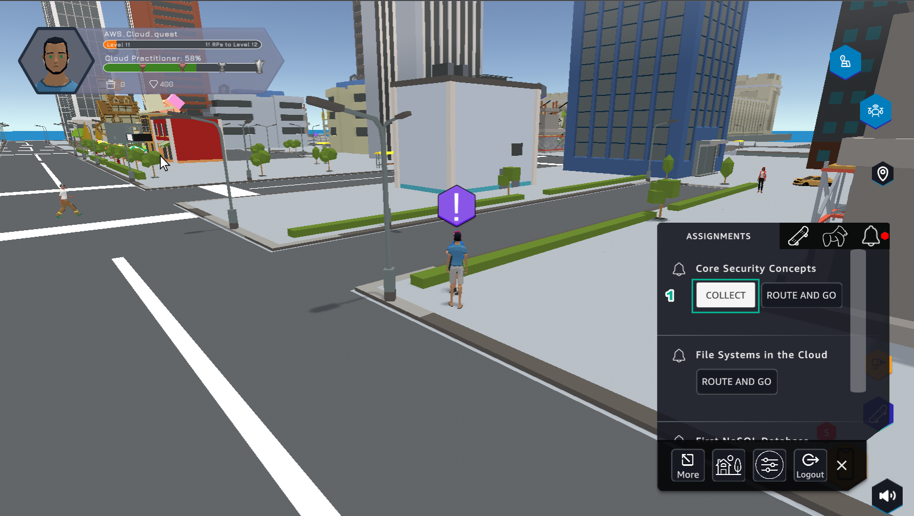

11.4 DIY
=================================

INFO!

After completing the lab, the player does DIY

1. In the AWS Console interface

- Find IAM

- Select IAM

.. image:: pictures/U1.png
   :align: center
   :width: 700px

2. In the IAM interface

- Select User groups

- Select Permissions

- Find AmazonEC2ReadOnlyAccess

- Select AmazonEC2ReadOnlyAccess

- Select Add permissions

.. image:: pictures/U2.png
   :align: center
   :width: 700px

3. In the IAM interface

- in Add permissions, select Attach policies

4. In the IAM interface

- Find RDSReadOnlyAccess

- Select AmazonRDSReadOnlyAccess

- Select Add permissions

5. In the IAM interface

- Select User groups

- Select Permissions

- View the Policy name

.. image:: pictures/U5.png
   :align: center
   :width: 700px

6. In the DIY interface

- Enter SupportEngineers

- Select VALIDATE

.. image:: pictures/U6.png
   :align: center
   :width: 700px

7. In the DIY interface

- After selecting VALIDATE, VALIDATION MESSAGE appears You have granted the correct permissions… is completed DIY

- Select EXIT to exit

8. In the city interface

- Select ASSIGNMENT

- Select COLLECT

9. Select NEXT

.. image:: pictures/U9.png
   :align: center
   :width: 700px

10. Select COLLECT

.. image:: pictures/U10.png
   :align: center
   :width: 700px

11. Congratulations to the award winning player

.. image:: pictures/U11.png
   :align: center
   :width: 700px
