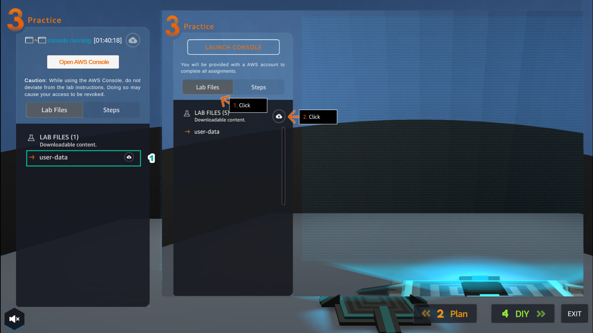
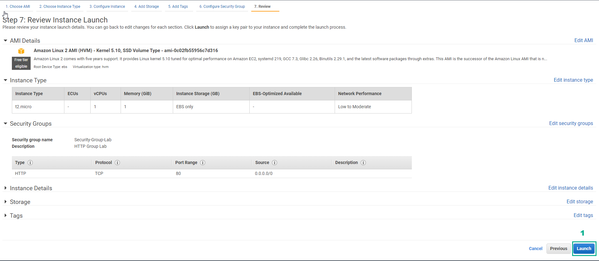
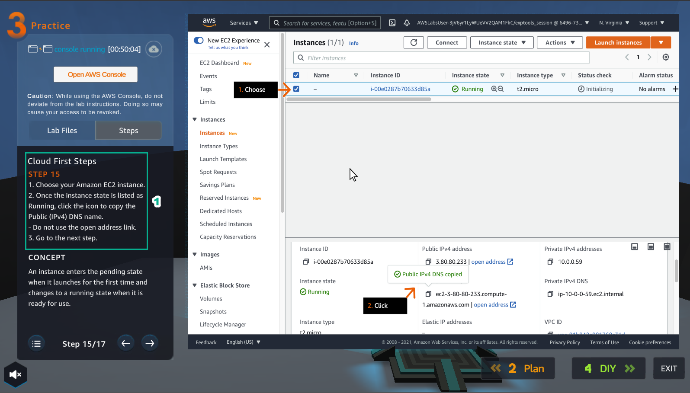
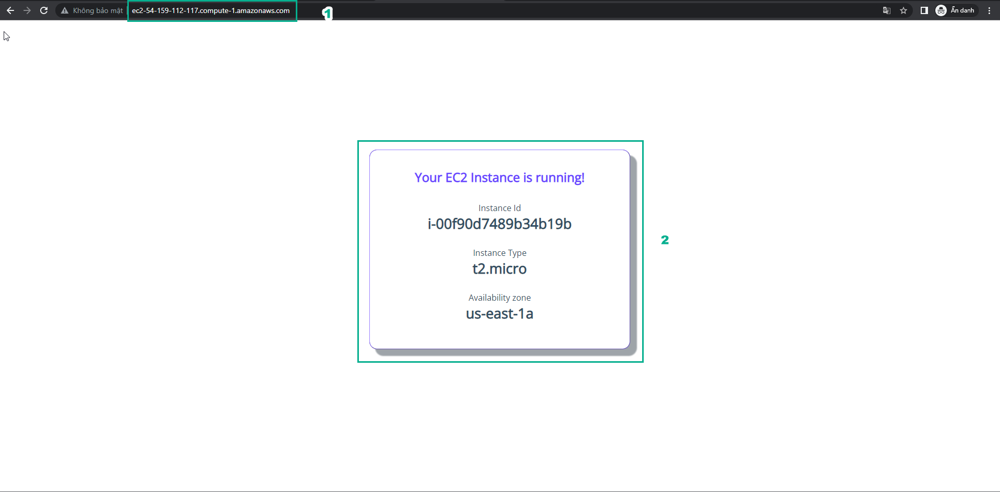

5.3 Practice
=================================

INFO!

After watching Plan, the player prepares for Practice

1. Select Practice to perform the lab

.. image:: pictures/pr1.png
   :align: center
   :width: 700px

2. Read the first step of Cloud First Steps and CONCEPT

- Select START LAB

- Select the arrow to the right to perform the next steps

.. image:: pictures/pr2.png
   :align: center
   :width: 700px

3. Select Open AWS Console

- Read step 2 of Cloud First Steps

4. Go to AWS Console page

- Find EC2 service and select

.. image:: pictures/pr4.png
   :align: center
   :width: 700px

5. Read step 3 of Cloud First Steps

- Select the arrow to the right to view and take the next step

.. image:: pictures/pr5.png
   :align: center
   :width: 700px

6. Go to AWS Console page

- Select EC2 Dashboard

- Select Launch instance

- Continue to select Launch instance

.. image:: pictures/pr6.png
   :align: center
   :width: 700px

7. Read step 4 of Cloud First Steps

.. image:: pictures/pr7.png
   :align: center
   :width: 700px

8. Go to AWS Console page

- Select Amazon Linux 2 AMI

9. Read step 5 of Cloud First Steps

.. image:: pictures/pr9.png
   :align: center
   :width: 700px

10. Go to AWS Console page

- Choose an Instance Type, select t2.micro

- Select Next: Configure Instance Details

.. image:: pictures/pr10.png
   :align: center
   :width: 700px

11. Read step 6 of Cloud First Steps

- Select Lab Files

.. image:: pictures/pr11.png
   :align: center
   :width: 700px

12. After selecting Lab Files, select user-data and download it

13. Read step 7 of Cloud First Steps

14. Go to AWS Console

- Select VPC

- Select Subnet

.. image:: pictures/pr14.png
   :align: center
   :width: 700px

15. Read step 8 of Cloud First Steps

16. In the Configure Instance Details section

- In Advanced Details, select As file

- Select Select file, and load the file user-data

- Then, select Next: Add Storage

.. image:: pictures/pr16.png
   :align: center
   :width: 700px

17. Read step 9 of Cloud First Steps

.. image:: pictures/pr17.png
   :align: center
   :width: 700px

18. Select Next: Add Tags

.. image:: pictures/pr18.png
   :align: center
   :width: 700px

19. Read step 10 of Cloud First Steps

.. image:: pictures/pr2.png
   :align: center
   :width: 700px

20. Select Next: Configure Security Group

.. image:: pictures/pr19.png
   :align: center
   :width: 700px

21. Read step 11 of Cloud First Steps

.. image:: pictures/pr20.png
   :align: center
   :width: 700px

22. Create a security group

- Security group name, enter Security-Group-Lab

- Description, enter HTTP Group Lab

- Rule, select HTTP

- Select Review and Launch

.. image:: pictures/pr21.png
   :align: center
   :width: 700px

23. Read step 12 of Cloud First Steps

24. Double check and select Launch

.. image:: pictures/pr23.png
   :align: center
   :width: 700px

25. Read step 13 of Cloud First Steps

26. Select Proceed without a key pair

- Select I acknowledge…

- Select Launch Instances

27. Read step 14 of Cloud First Steps

.. image:: pictures/pr26.png
   :align: center
   :width: 700px

28. Select View Instance

29. Read step 15 of Cloud First Steps

.. image:: pictures/pr28.png
   :align: center
   :width: 700px

30. Select the Amazon EC2 instance just created

- Find and copy Public(IPv4) DNS name

31. Read step 16 of Cloud First Steps

.. image:: pictures/pr30.png
   :align: center
   :width: 700px

32. Paste Public(IPv4) DNS name into the browser and Enter

- View results

.. image:: pictures/pr31.png
   :align: center
   :width: 700px

33. Congratulations to the player on completing the lab

