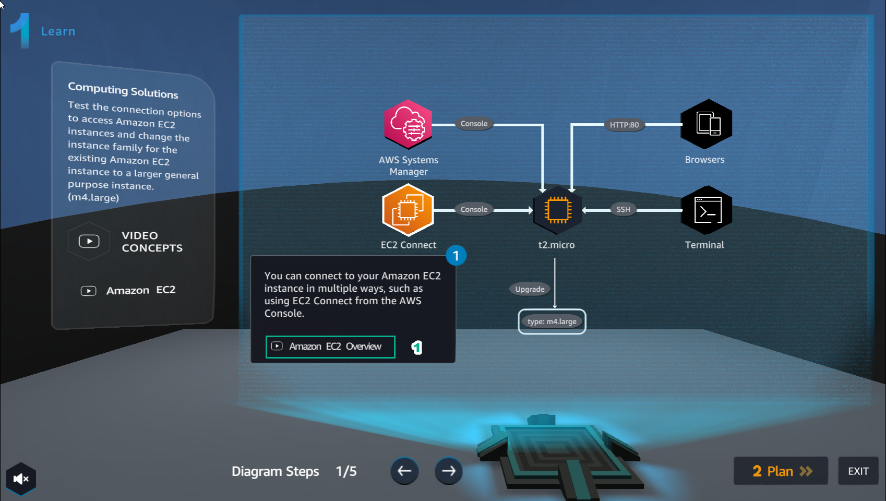
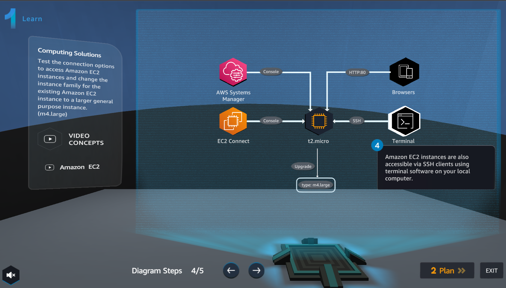

6.1 Learn
=================================

INFO!

Learn helps players understand more about Amazon EC2 theory

1. After entering the Learn interface, select Amazon EC2 Overview

2. Watch VIDEO CONCEPTS, then select X

.. image:: pictures/a3l2.png
   :align: center
   :width: 700px

3. In the Learn interface, select the right arrow to view step 2 of Diagram Steps

.. image:: pictures/a3l3.png
   :align: center
   :width: 700px

4.Continue to select the right arrow to see step 3 of Diagram Steps

.. image:: pictures/a3l4.png
   :align: center
   :width: 700px

5. Continue to select the right arrow to see step 4 of Diagram Steps

6. Continue to select the right arrow to see step 5 of Diagram Steps

