6.4 DIY
=================================

INFO!

After completing the lab, the player does DIY

1. Select DIY

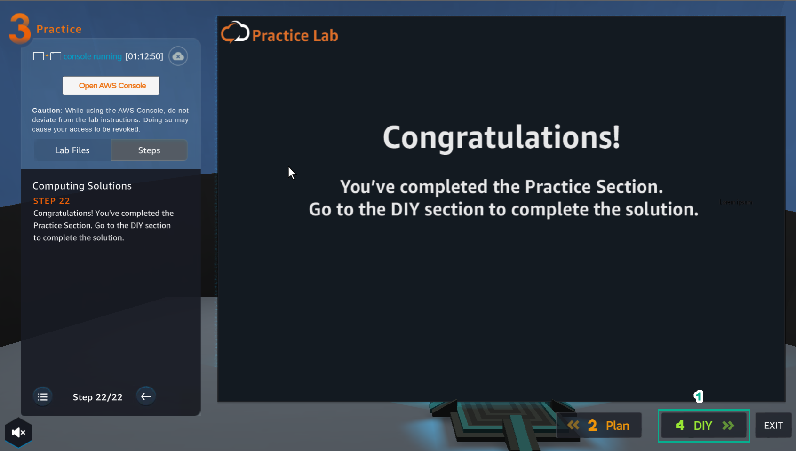

2. In the DIY interface

- Read DIY ACTIVITIES

- Read SOLUTION VALIDATION METHOD

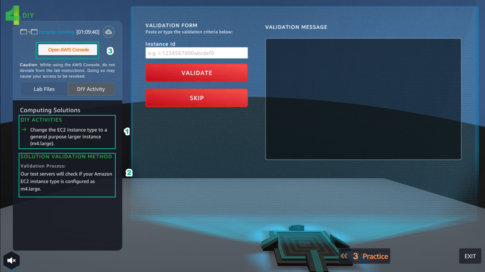

3. For this DIY, we do To change the instance type for a new instance configuration

- Go to the AWS Console page, find and select EC2

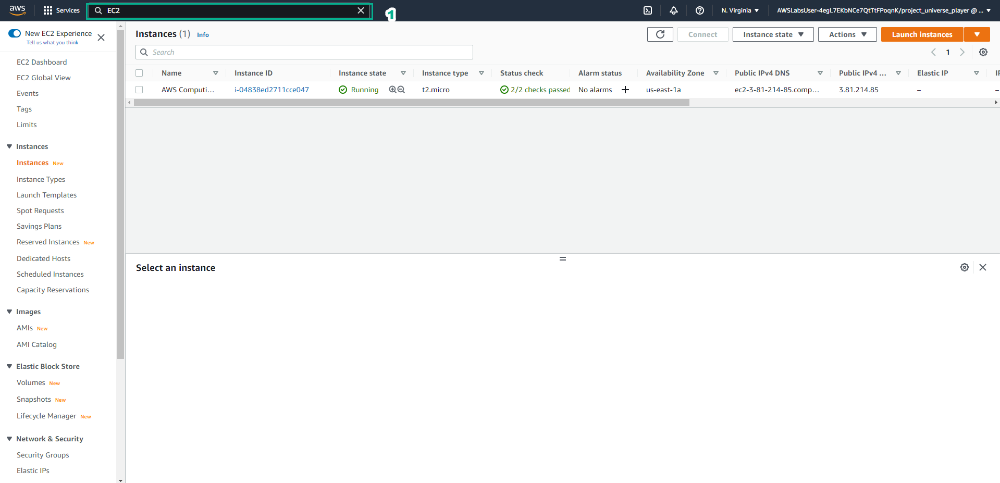

4. In EC2 interface

- Select Instances

- Select Launch instances

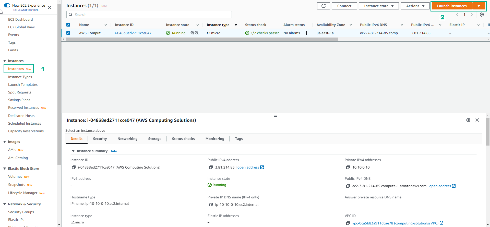

5. In Choose an Amazon Machine Image (AMI)

- Select Amazon Linux 2 AMI (HVM) - Kernel 5.10, SSD Volume Type

- Select Select

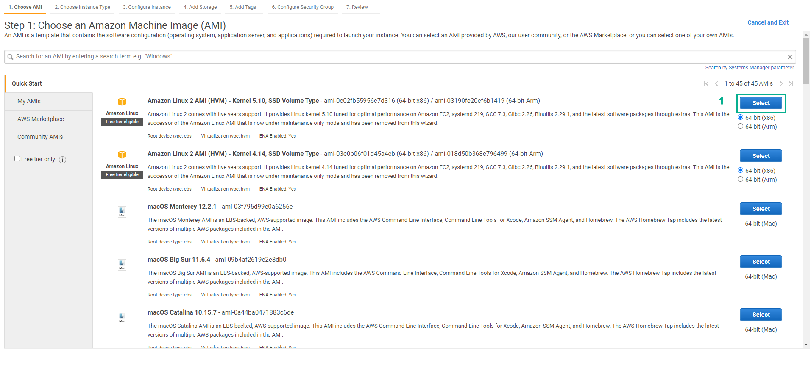

6. In Choose an Instance Type

- Select m4.large

- Then, select Next: Configure Instance Details

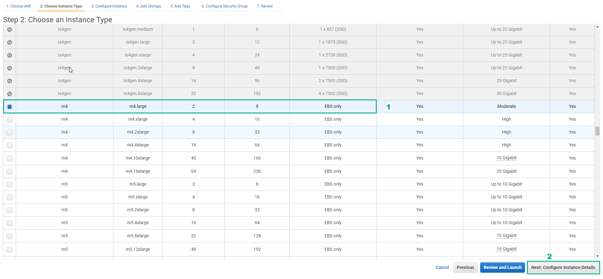

7. In Configure Instance Details

- Select VPC

- Select subnet

- Select Next: Add Storage

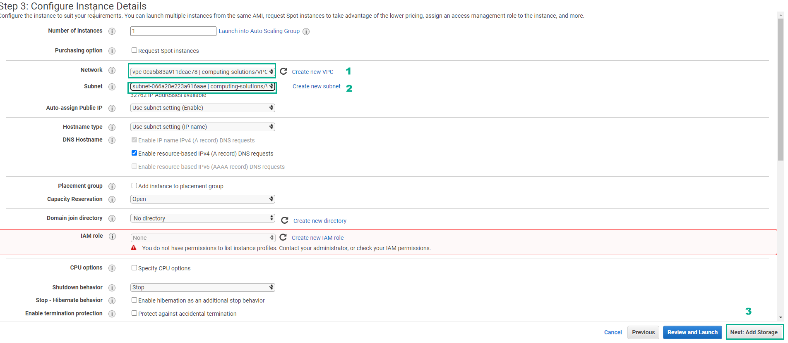

8. In Add Storage, select Next: Add Tags

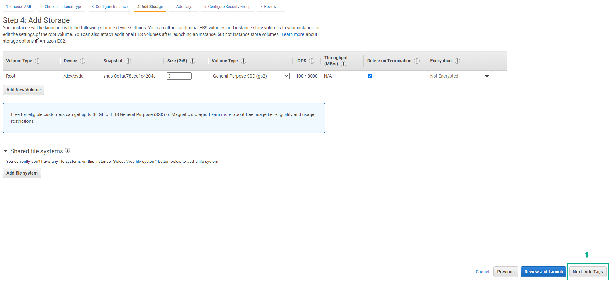

9. In Add Tags, Select Next: Configure Security Group

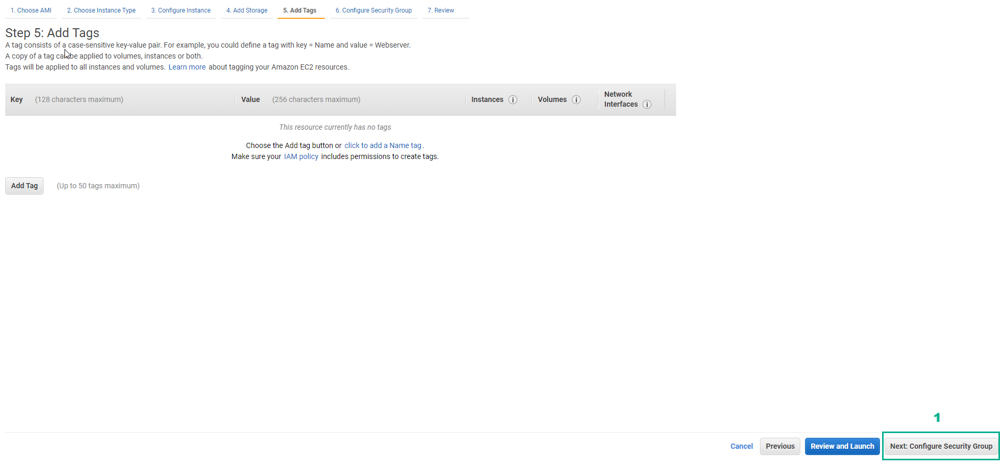

10. In Configure Security Group

- Select Select an existing security group

- Select Security Group ID

- Select Review and Launch

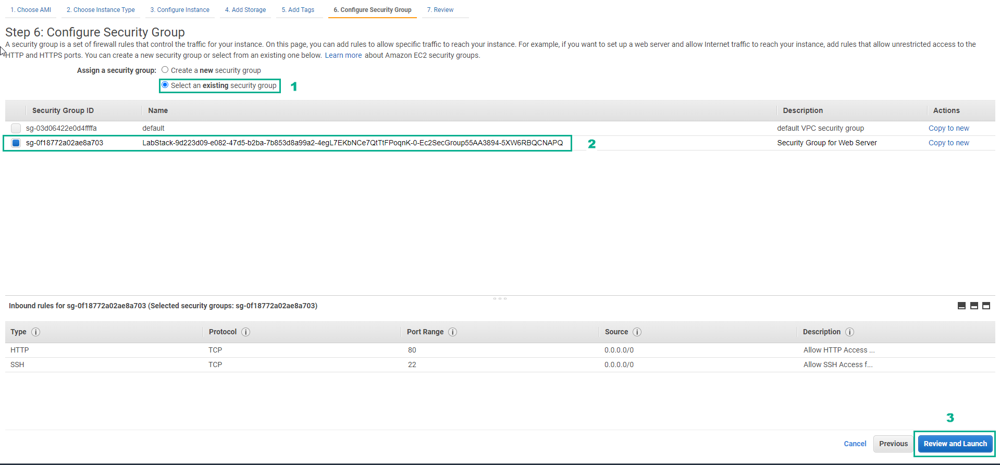

11. In Review Instance Launch

- Check again and select Launch

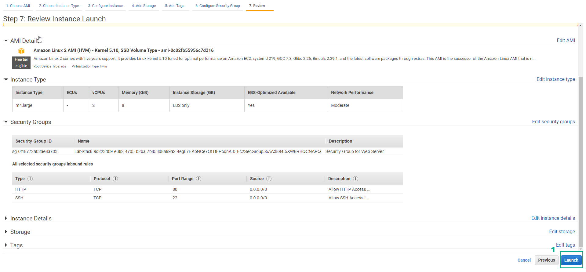

12. In Select an existing key pair or create a new key pair

- Select Proceed without a key pair

- Select I acknowledge…

- Select Launch Instances

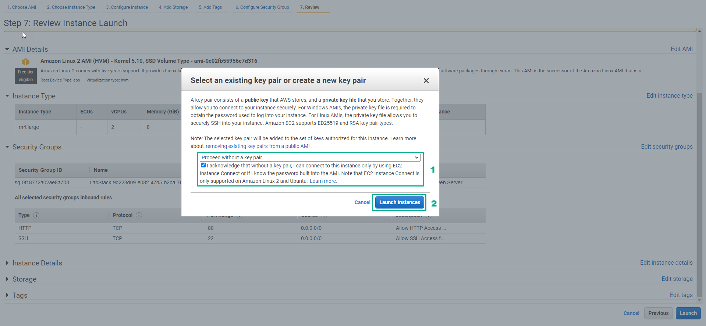

13. Select View Instances

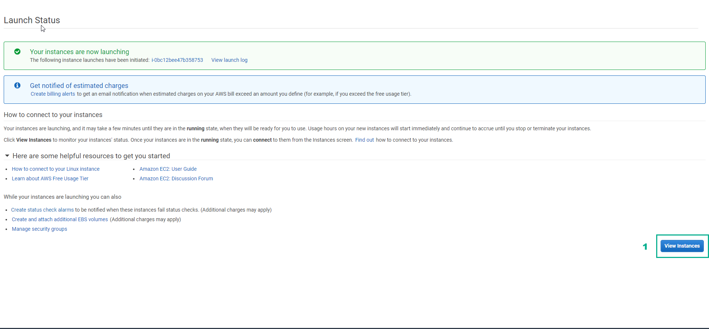

14. Copy Instance ID

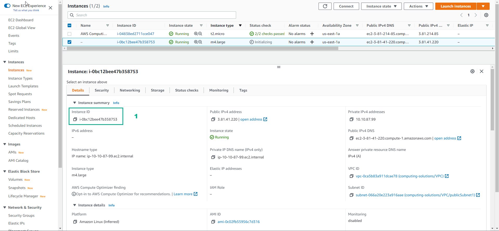

15. In the DIY interface

- Paste Instance ID into VALIDATION FORM

- Then select VALIDATE

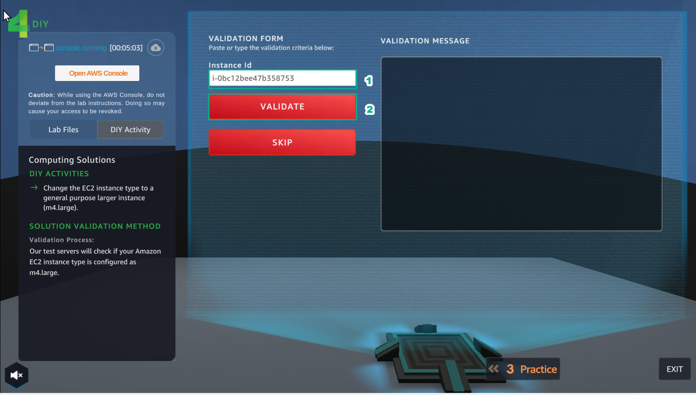

16. In the DIY interface

- Paste Instance ID into VALIDATION FORM

- Then select VALIDATE

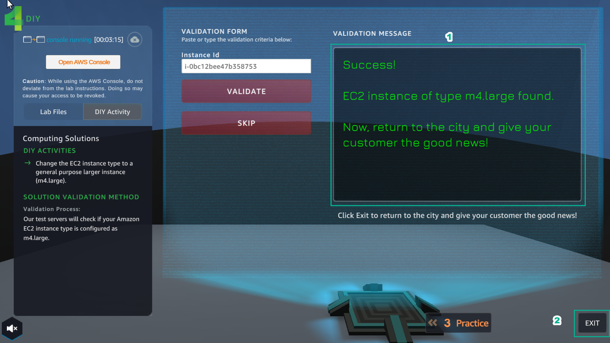

17. In ASSIGNMENT select COLLECT

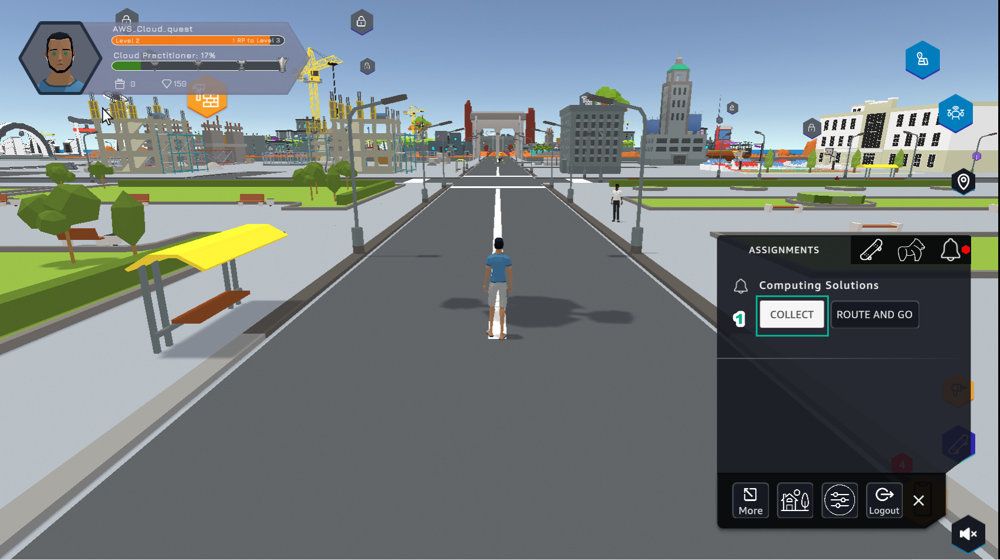

18. Select NEXT

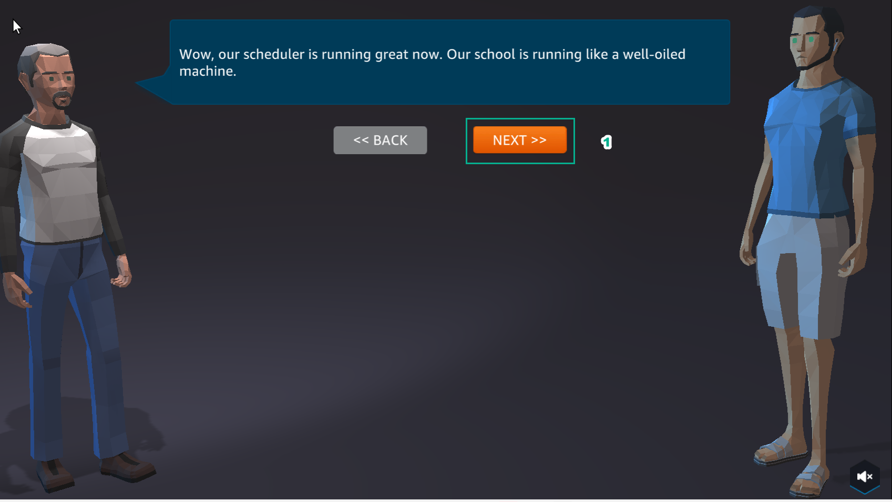

19. Select COLLECT

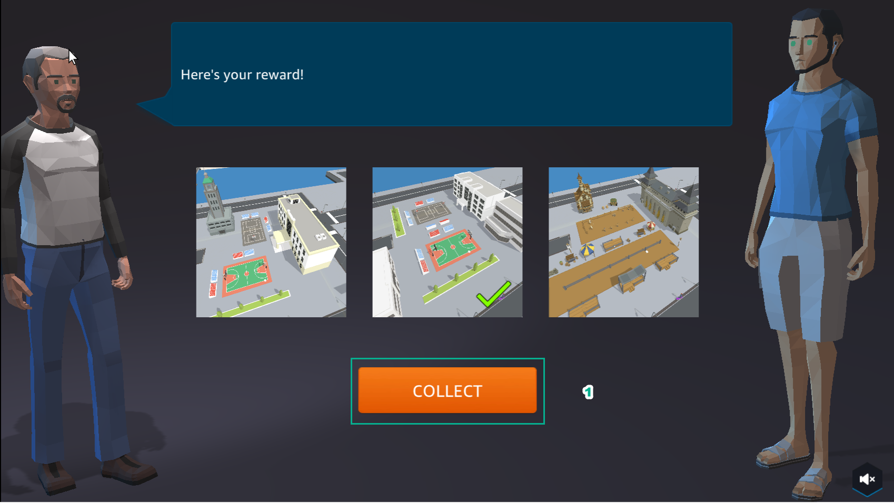

20. Congratulations on completing Assignment 3

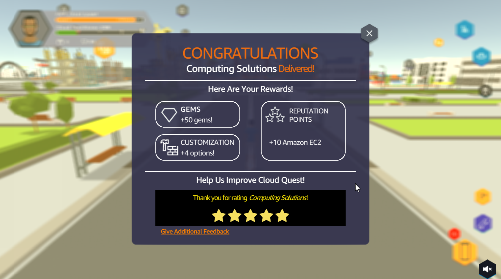

