7.4 DIY
=================================

INFO!

After completing the lab, the player does DIY

1. Select DIY

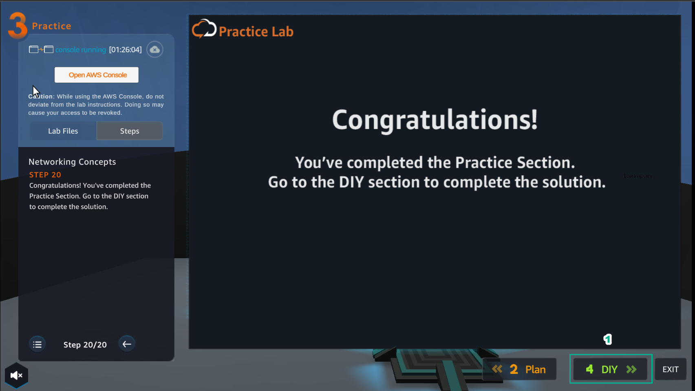

2. The DIY interface appears including:

- Lab Files

- DIY Activity

- Networking Concepts

- VALIDATION FORM

- Read SOLUTION VALIDATION METHOD
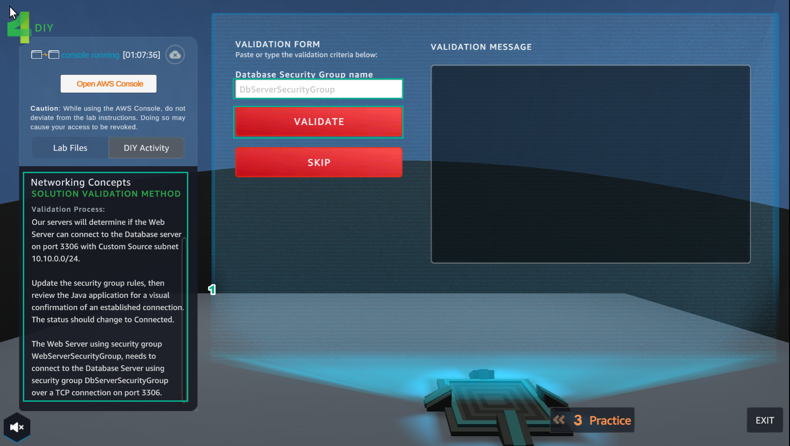

3. In the AWS Console page, find and select EC2

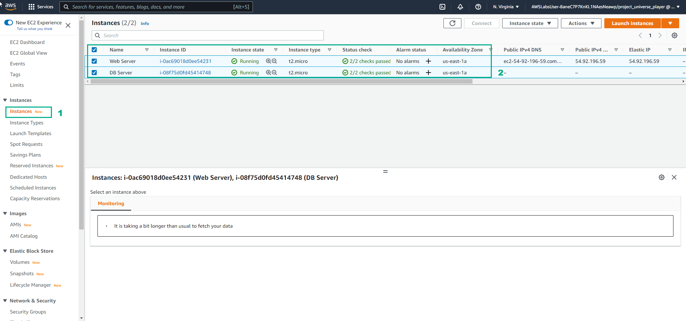

4. Select Instances

- Select Security

- In Security groups, select DbServerSecurityGroup

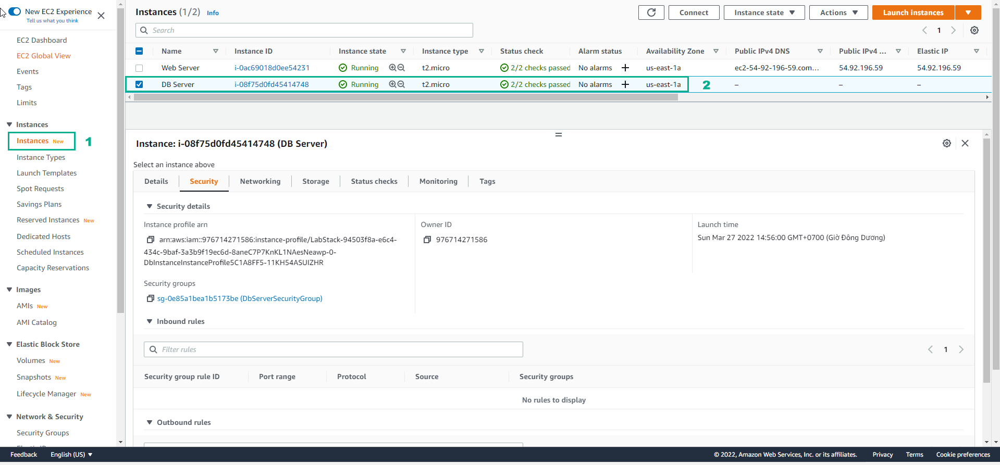

5. In the Security Groups interface

- Select Edit inbound rules

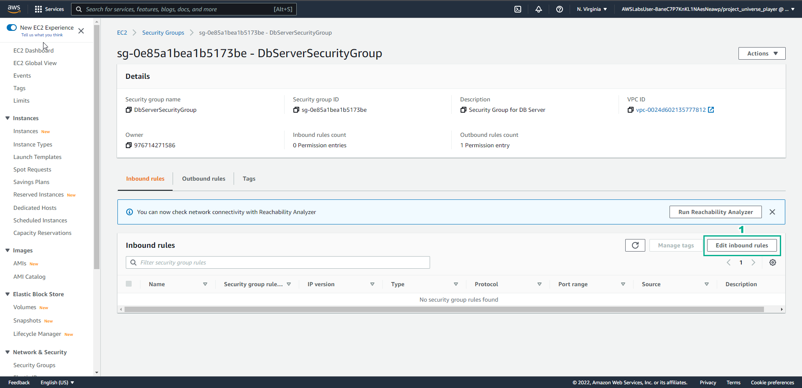

6. In the Edit inbound rules interface

- Type: select MYSQL/Aurora

- Protocol: select TCP

- Prot range: enter 3306

- Source: choose Custom

- Then select Save rules

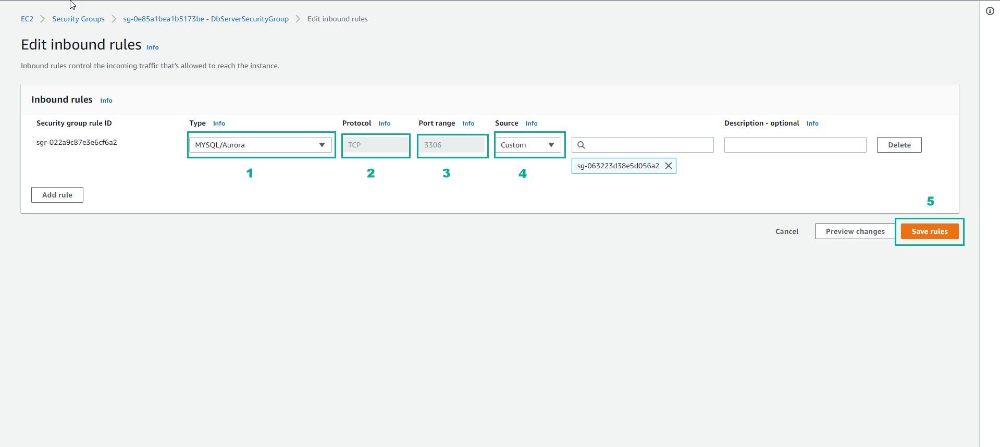

7. Interface after creating DbServerSecurityGroup

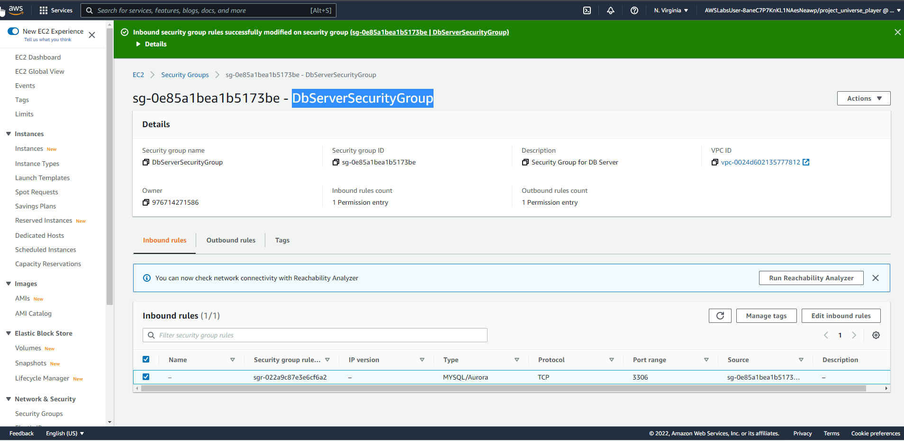

8. In the Security groups view, copy Security group name

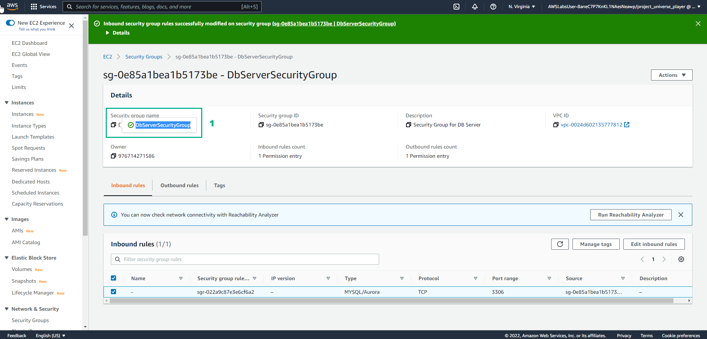

9. After copying Security group name

- Paste Security group name into VALIDATION FORM in Database Security Group name field

- Then select VALIDATE

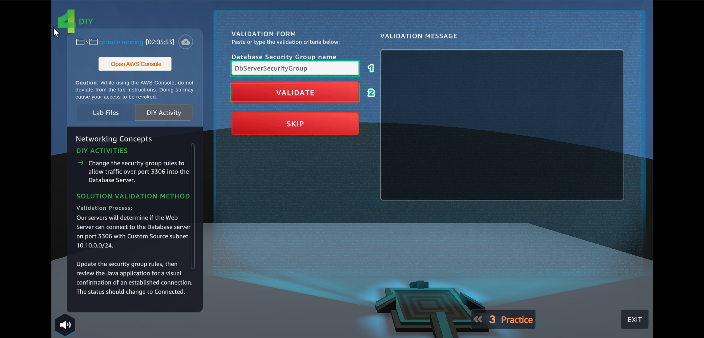

10. Results

- On VALIDATION MESSAGE, appears Nice!You have properly configured your security! and done DIY

- Select EXIT to exit

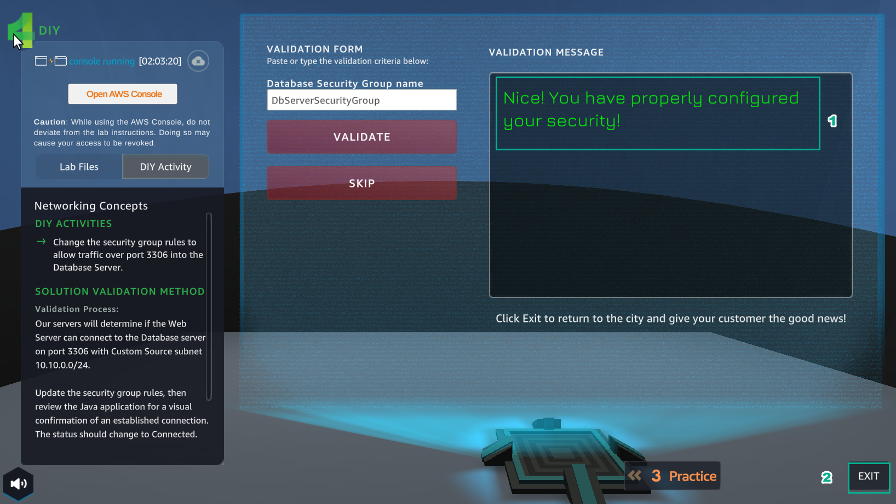

11. Select NEXT

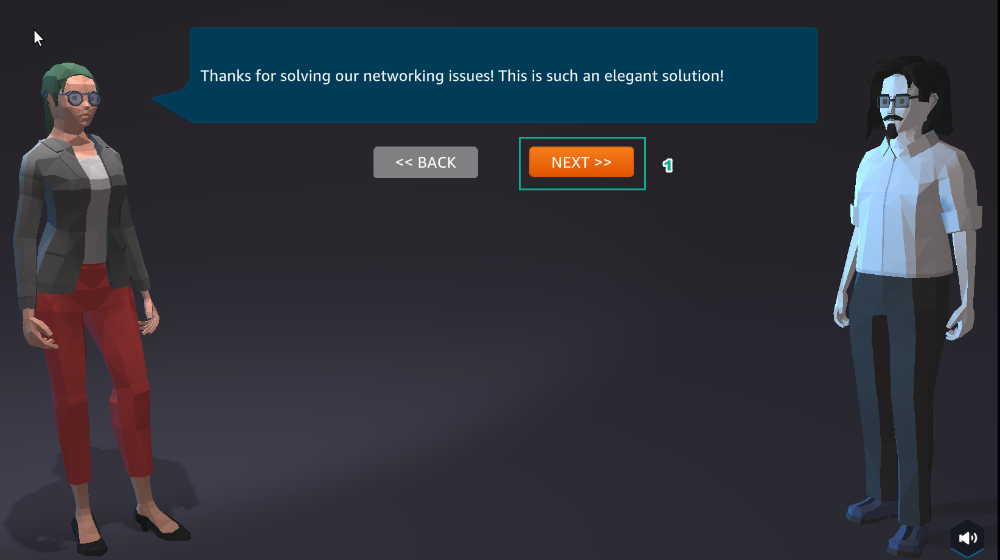

12. Select COLLECT

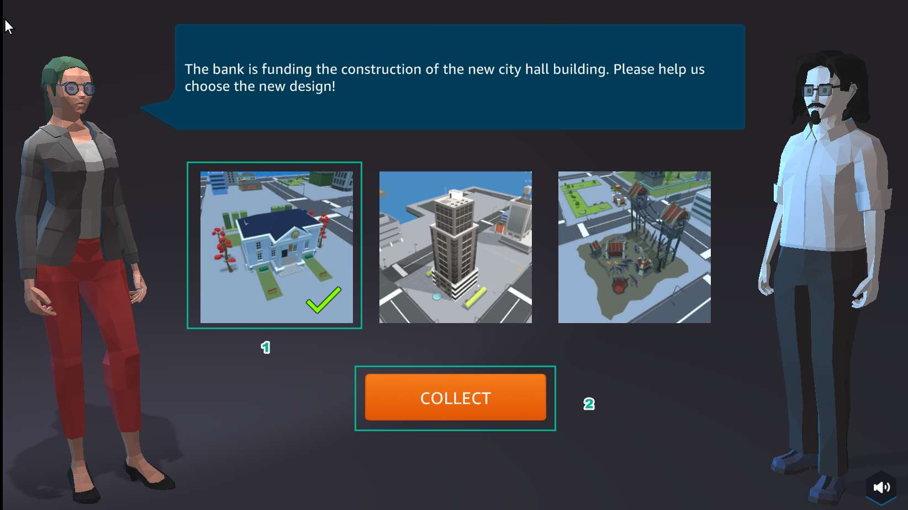

13. Congratulations on completing lab 7

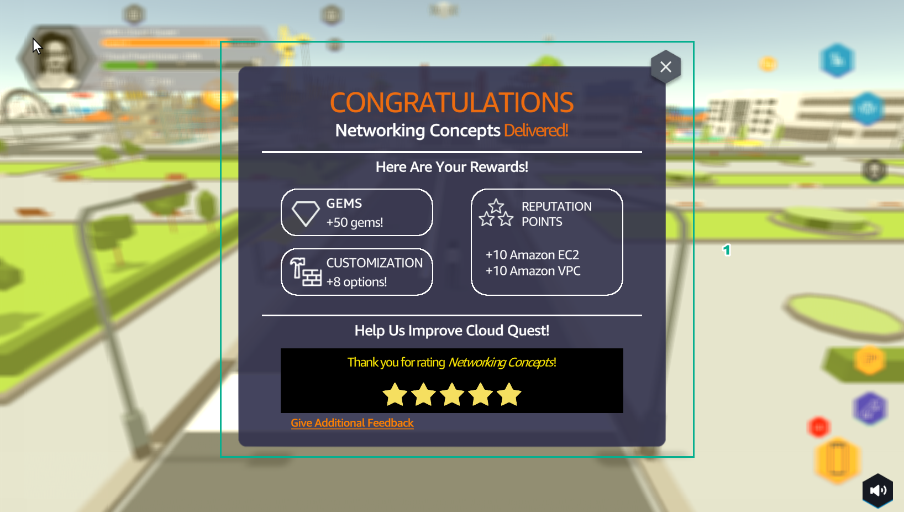
