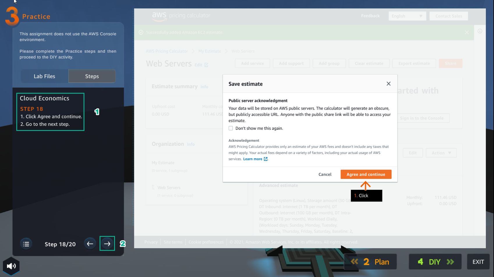

8.3 Practice
=================================

INFO!

After watching Plan, the player prepares for Practice

- In the Practice interface

- Read step 1 of Cloud Economics

- Read CONCEPT

1. Select the arrow to the right to see the next step

2. In the Practice interface

- Read step 2 of Cloud Economics

- Read CONCEPT

- Select the arrow to the right to see the next steps

3. Open the browser

- Access to https://calculator.aws/#/

- Select Create estimate

.. image:: pictures/n3.png
   :align: center
   :width: 700px

4. In the Practice interface

- Read step 3 of Cloud Economics

- Read CONCEPT

- Select the arrow to the right to see the next steps

5. Select My Estimate

.. image:: pictures/n5.png
   :align: center
   :width: 700px

6. In the Practice interface

- Read step 4 of Cloud Economics

- Read CONCEPT

- Select the arrow to the right to see the next steps

.. image:: pictures/n6.png
   :align: center
   :width: 700px

7. In the My Estimate interface

- Select Add group

.. image:: pictures/n7.png
   :align: center
   :width: 700px

8. In the Practice interface

- Read step 5 of Cloud Economics

- Read CONCEPT

- Select the arrow to the right to see the next steps

.. image:: pictures/n8.png
   :align: center
   :width: 700px

9. In the Add group interface

- In Group settings, Group name field enter Web Servers

- Then, select Add group

.. image:: pictures/n9.png
   :align: center
   :width: 700px

10. In the Practice interface

- Read step 6 of Cloud Economics

- Read CONCEPT

- Select the arrow to the right to see the next steps

.. image:: pictures/n10.png
   :align: center
   :width: 700px

11. In the Web Server interface

- Select Add service

12. In the Practice interface

- Read step 7 of Cloud Economics

- Read CONCEPT

- Select the arrow to the right to see the next steps

.. image:: pictures/n12.png
   :align: center
   :width: 700px

13. In the Add service interface

- Find EC2

- Select Configure

14. In the Practice interface

- Read step 8 of Cloud Economics

- Read CONCEPT

- Select the arrow to the right to see the next steps

.. image:: pictures/n14.png
   :align: center
   :width: 700px

15. In the Configure Amazon EC2 interface

- In Description, enter Web Server Estimate

- Region, select US East (N. Virginia)

- Select Advanced estimate

16. In the Practice interface

- Read step 9 of Cloud Economics

- Read CONCEPT

- Select the arrow to the right to see the next steps

.. image:: pictures/n16.png
   :align: center
   :width: 700px

17. In EC2 instance specifications

- Operating system, select Linux

- Workload, select Daily spike traffic

- Workload days, choose the days of the week

.. image:: pictures/n17.png
   :align: center
   :width: 700px

18. In the Practice interface

- Read step 10 of Cloud Economics

- Read CONCEPT

- Select the arrow to the right to see the next steps

19. In Daily spike pattern

- Baseline, enter 2

- Peak, enter 4

- Duration of peak, enter 8 and 0

.. image:: pictures/n19.png
   :align: center
   :width: 700px

20. In the Practice interface

- Read step 11 of Cloud Economics

- Read CONCEPT

- Select the arrow to the right to see the next steps

21.In EC2 Instances

- Enter 2

- Select 4 GiB

- Chon5 Any Network Performance

- Select t2.medium

.. image:: pictures/n21.png
   :align: center
   :width: 700px

22. In the Practice interface

- Read step 12 of Cloud Economics

- Read CONCEPT

- Select the arrow to the right to see the next steps

.. image:: pictures/n22.png
   :align: center
   :width: 700px

23. In Pricing strategy

- Select On-Demand

- Select Show calculations

- Select estimated workload hours

24. In the Practice interface

- Read step 13 of Cloud Economics

- Read CONCEPT

- Select the arrow to the right to see the next steps

25. View Estimated workload hours

26. In the Practice interface

- Read step 14 of Cloud Economics

- Read CONCEPT

- Select the arrow to the right to see the next steps

.. image:: pictures/n26.png
   :align: center
   :width: 700px

27. In Amazon Elastic Block Storage (EBS)

- Storage for each EC2 instance, select General Purpose SSD (gp2)

- Storage amount, enter 30

- Snapshot Frequency, select Weekly

- Amount changed per snapshot, select 1

.. image:: pictures/n27.png
   :align: center
   :width: 700px

28. In the Practice interface

- Read step 15 of Cloud Economics

- Read CONCEPT

- Select the arrow to the right to see the next steps

.. image:: pictures/n28.png
   :align: center
   :width: 700px

29. In Data Transfer

- Select Internet (free), enter 1, select TB per month

- In Outbound Data Transfer, select Internet($0.05 - $0.09 per GB), enter 100, select GB per month

- Select Show calculations

30. In the Practice interface

- Read step 16 of Cloud Economics

- Read CONCEPT

- Select the arrow to the right to see the next steps

31. Review and select Add to my estimate

32. In the Practice interface

- Read step 17 of Cloud Economics

- Read CONCEPT

- Select the arrow to the right to see the next steps

.. image:: pictures/n32.png
   :align: center
   :width: 700px

33. Result interface Web Servers, select Share

.. image:: pictures/n33.png
   :align: center
   :width: 700px

34. In the Practice interface

- Read step 18 of Cloud Economics

- Read CONCEPT

- Select the arrow to the right to see the next steps

35. In Save estimate

- Select Agree and continue

36. In the Practice interface

- Read step 19 of Cloud Economics

- Read CONCEPT

- Select the arrow to the right to see the next steps

37. Select Copy public link

38. Congratulations to the player on completing the lab

.. image:: pictures/n38.png
   :align: center
   :width: 700px

