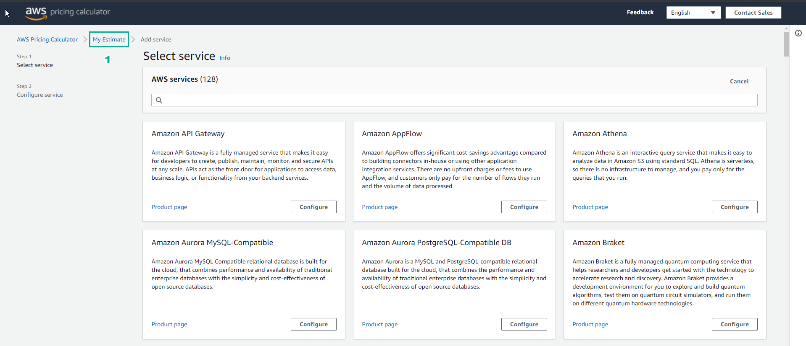

8.4 DIY
=================================

INFO!

After completing the lab, the player does DIY

1. In the DIY interface

- Read DIY ACTIVITIES

- Read SOLUTION VALIDATION METHOD

.. image:: pictures/K1.png
   :align: center
   :width: 700px

2. Go to https://calculator.aws/#/

- Select Create estimate

.. image:: pictures/K2.png
   :align: center
   :width: 700px

3. In My Estimate

- Select Add group

.. image:: pictures/K3.png
   :align: center
   :width: 700px

4. In Add group

- Group name, enter Web Servers

- Select Add group

.. image:: pictures/K4.png
   :align: center
   :width: 700px

5. In the Web Servers interface

- Select Add service

6. In Add service

- Search EC2

- Select Configure

.. image:: pictures/K6.png
   :align: center
   :width: 700px

7. In Configure Amazon EC2

- Description, enter Web Server Estimate

- Region, select US East (N. Virginia)

- In EC2 instance specifications, select Linux

.. image:: pictures/K7.png
   :align: center
   :width: 700px

8. In the Workload interface

- Select Daily spike traffic

- Daily spike pattern, Workload days section, choose the days of the week

- Baseline, enter 2

- Peak, enter 4

- Duration of peak, enter 8 and 0

.. image:: pictures/K8.png
   :align: center
   :width: 700px

9. In EC2 Instances

- Select t2.micro

.. image:: pictures/K9.png
   :align: center
   :width: 700px

10. In Pricing strategy

- Pricing model, select On-demand

- Select Show calculations

- Select estimate workload hours

.. image:: pictures/K10.png
   :align: center
   :width: 700px

11. In Amazon Elastic Block Storage (EBS)

- Storage for each EC2 instance, select General Purpose SSD (gp2)

- Storage amount, enter 30

- Snapshot Frequency, enter Weekly

- Amount changed per snapshot, enter 1

.. image:: pictures/K11.png
   :align: center
   :width: 700px

12. View results Estimated workload hours

.. image:: pictures/K12.png
   :align: center
   :width: 700px

13. In Data Transfer

- Inbound Data Transfer, select Internet (free)

- Select 1

- Select TB per month

- Outbound Data Transfer, select Internet ($0.05 - $0.09 per GB)

- Select 100

- Select TB per month

.. image:: pictures/K13.png
   :align: center
   :width: 700px

14. Select Show calculations

- View and select Add to my estimate

.. image:: pictures/K14.png
   :align: center
   :width: 700px

15.In the Web Servers interface

- Select Share

.. image:: pictures/K15.png
   :align: center
   :width: 700px

16. In the Save estimate interface

- Select Copy public link

.. image:: pictures/K16.png
   :align: center
   :width: 700px

17. After Copy public link

- Enter the DIY interface

- Paste in VALIDATION FORM

- Select VALIDATE

- On VALIDATION MESSAGE, appearing Great job!… is completed DIY

- Then select EXIT to exit

.. image:: pictures/K17.png
   :align: center
   :width: 700px

18.After the city interface

- Go to ASSIGNMENT, select COLLECT

.. image:: pictures/K18.png
   :align: center
   :width: 700px

19. Select NEXT

.. image:: pictures/K19.png
   :align: center
   :width: 700px

20. Select COLLECT

.. image:: pictures/K20.png
   :align: center
   :width: 700px

21. Select COLLECT

.. image:: pictures/K21.png
   :align: center
   :width: 700px

