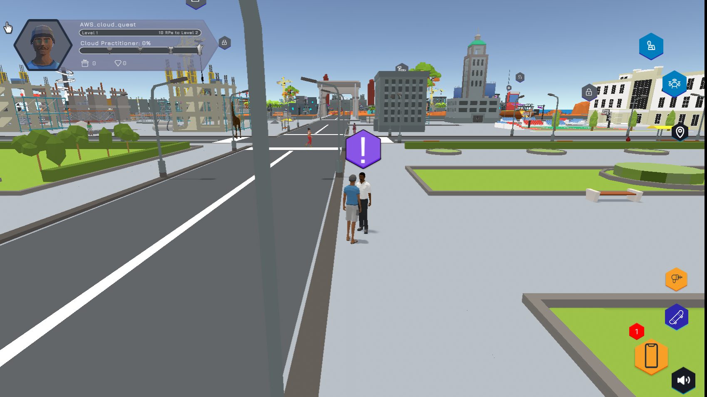
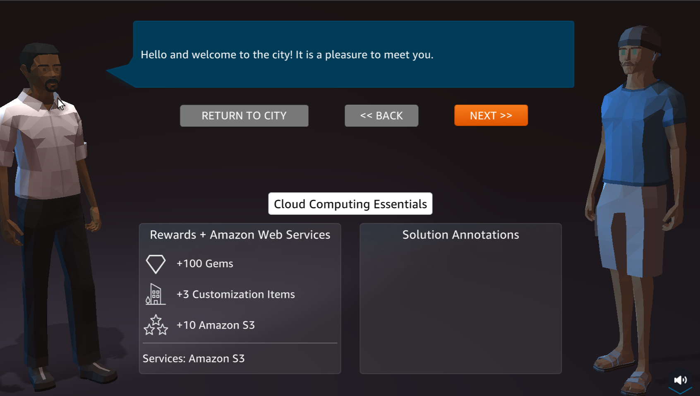
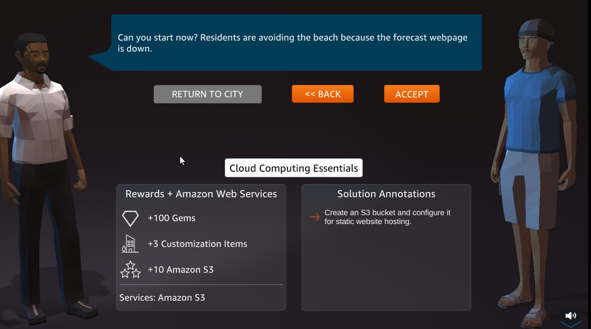
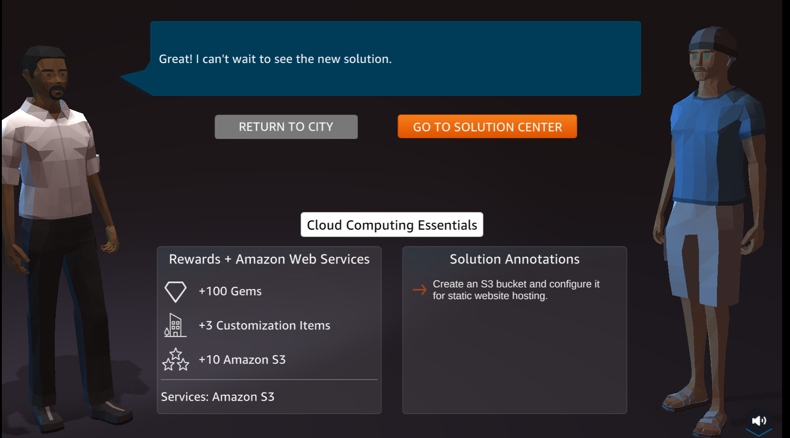
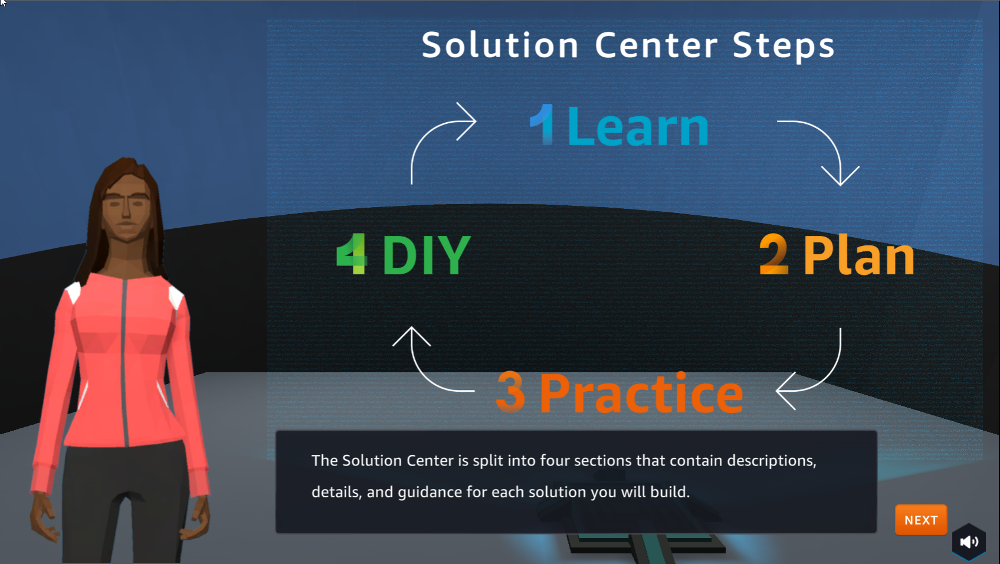

A1 - Static web hosting
==================

Overview
--------

In this step we will take the first challenge in Cloud Quest.

Content
--------
.. toctree::
   :maxdepth: 2
   :caption: content

 Learn
 Plan
 Practice
 DIY

Perform
--------

1. In the city interface

- Select ASSIGNMENT

- In Cloud Computing Essentials, select ROUTE AND GO

.. image:: pictures/24.png
   :align: center
   :width: 700px

2. Select the ! icon to go to the next step

3. Select NEXT

4. In the preparation interface

- View Rewards

- See Solution Annotations

- Select ACCEPT

5. Select GO TO SOLUTION CENTER

6. Welcome to Solution Center

.. image:: pictures/29.png
   :align: center
   :width: 700px

7. Steps of Solution Center Steps

