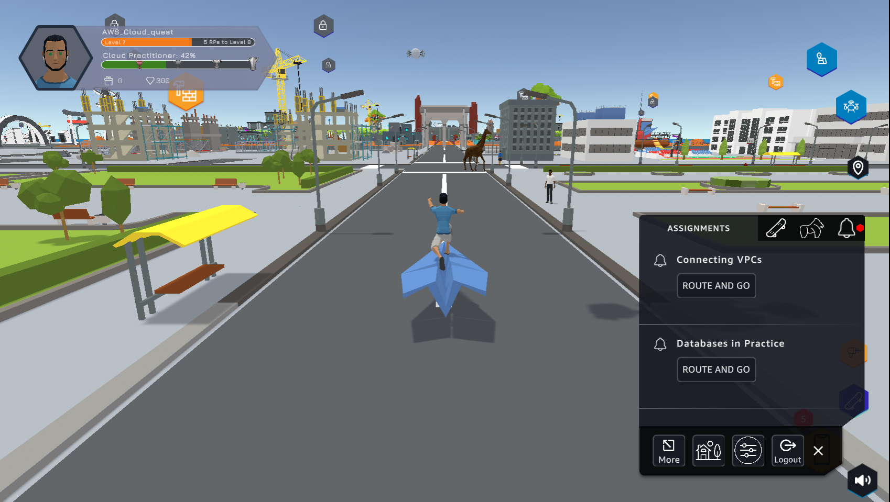
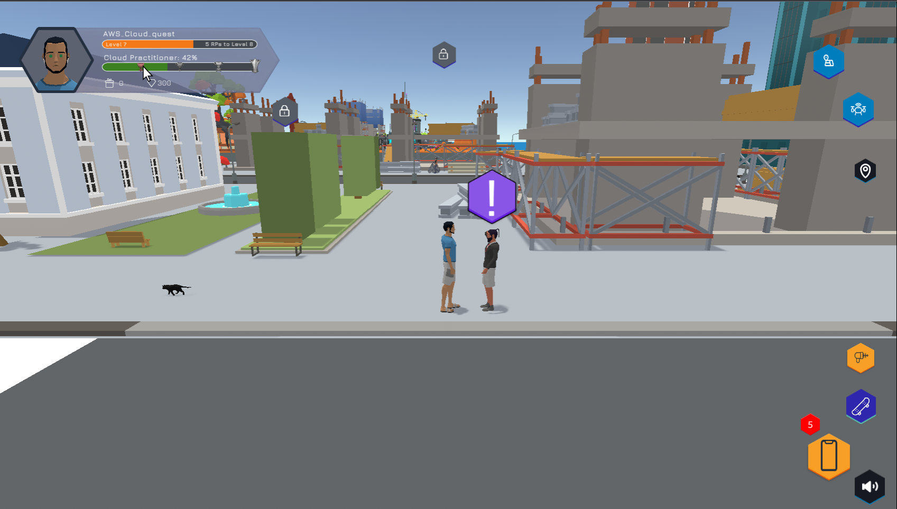
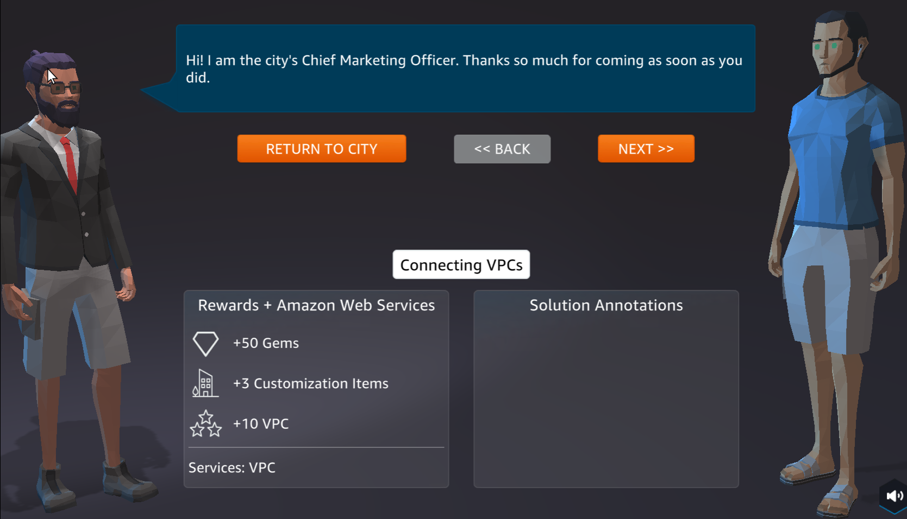
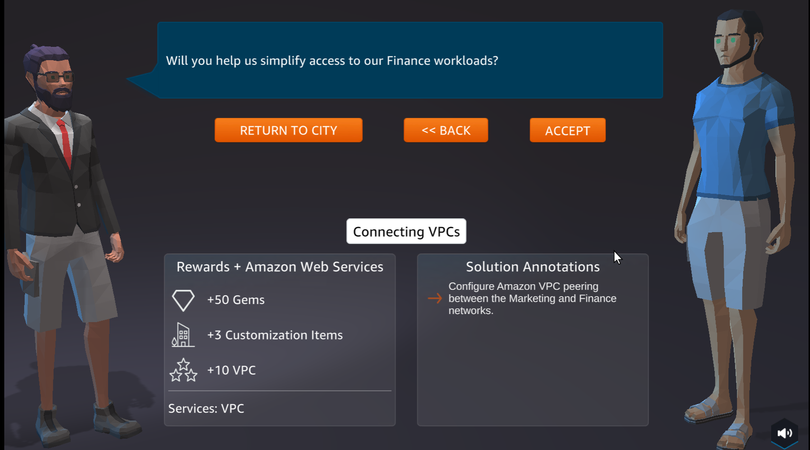
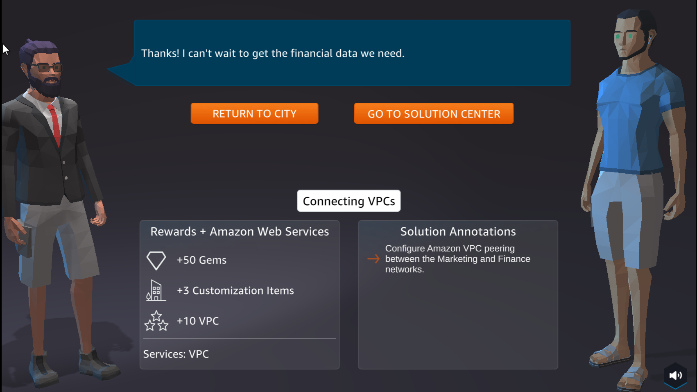

A6 - Connecting Amazon VPCs
==================

Overview
--------

Lab #6 of AWS Cloud Quest: Cloud Practitioner is Connecting Amazon VPCs

1. In ASSIGNMENTS

- Select ROUTE AND GO

2. Select the ! icon

3. Select NEXT

- View Rewards

4. Select ACCEPT

5. See Solution Annotations

- Select GO TO SOLUTION CENTER

Content
--------
.. toctree::
   :maxdepth: 2
   :caption: content

 9.1 Learn
 9.2 Plan
 9.3 Practice
 9.4 DIY

