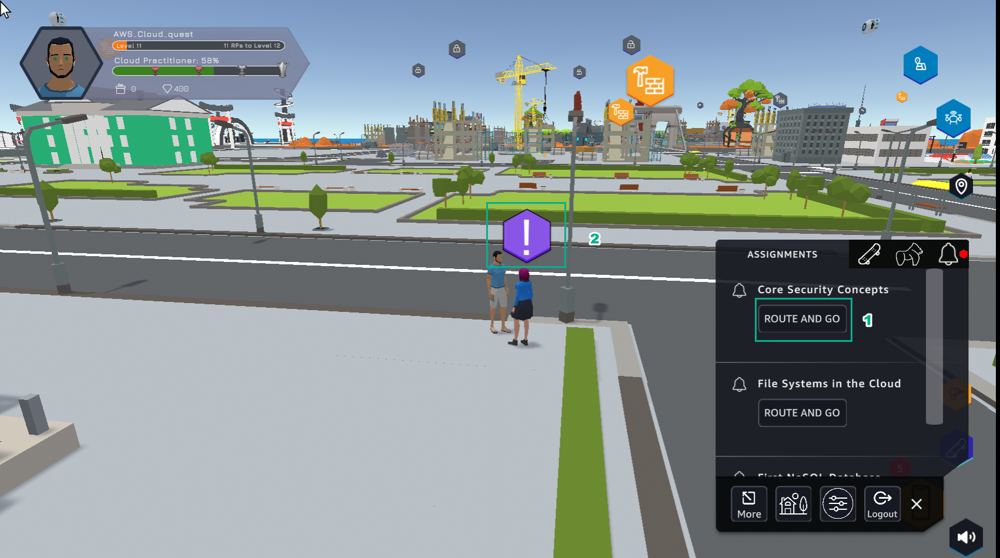
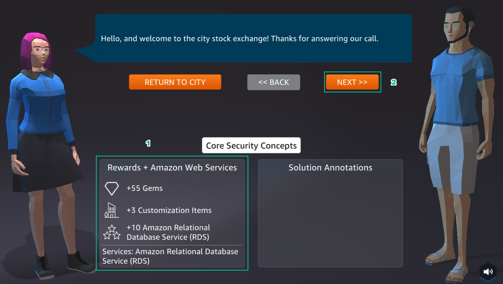
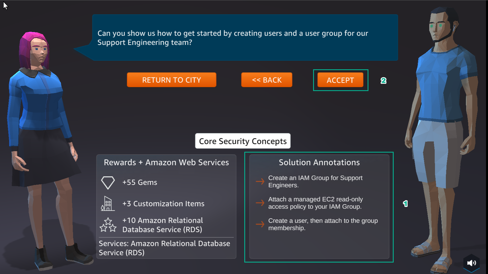

A8 - Security
==================

Overview
--------

AWS Cloud Quest: Cloud Practitioner’s 8th lab is Defining Usr and Group Permissions using IAM Policies

1. In the city interface

- Select ASSIGNMENTS

- Select ROUTE AND GO

- Choose the icon !

2. In the city interface

- View Rewards

- Select NEXT

3. In the city interface

- See Solution Annotations

- Select ACCEPT

4. Select GO TO SOLUTION CENTER

.. image:: pictures/004.png
   :align: center
   :width: 700px

Content
--------
.. toctree::
   :maxdepth: 2
   :caption: content

 11.1 Learn
 11.2 Plan
 11.3 Practice
 11.4 DIY

