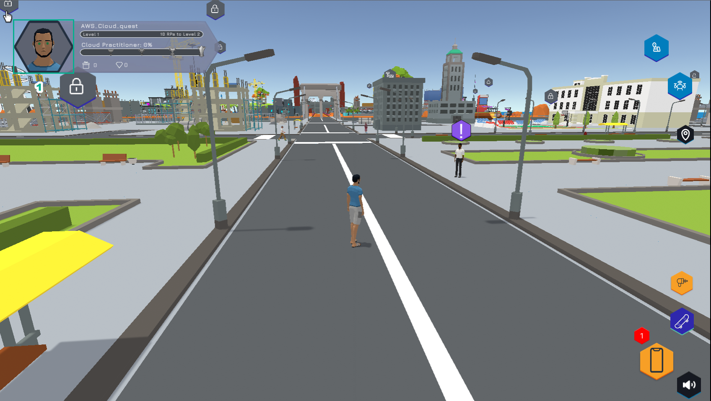
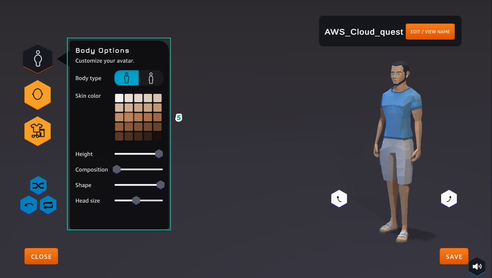
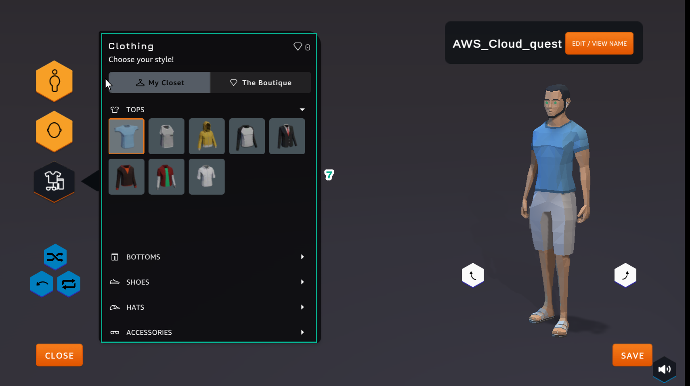
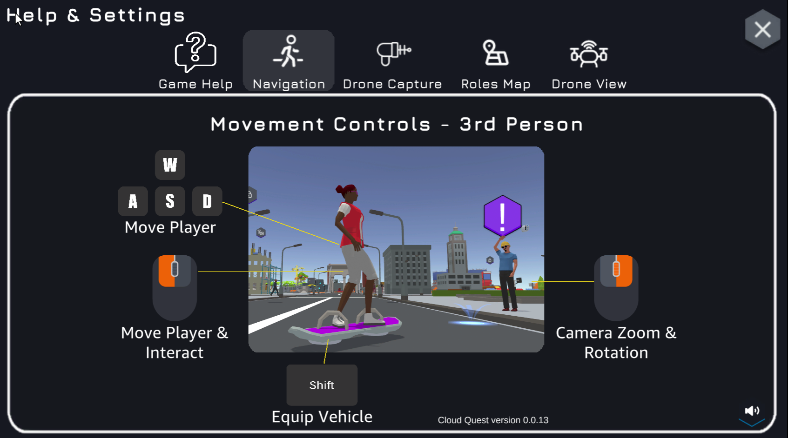

Build profile
====================

After the city interface appears, we build the player profile

1. Click on the profile picture to go to the Custom Profile page

2. In Custom Profile page

.. image:: pictures/17.png
   :align: center
   :width: 700px

3. Select EDIT/VIEW to perform player naming

- At least 3 characters

- Up to 25 characters

- Only letters and numbers

- ‘_’ and '’

- No leading or trailing whitespace

4. Select ACCEPT

.. image:: pictures/18.png
   :align: center
   :width: 700px

5. Section Body Options

- Select Body type

- Select Skin color

- Select Height

- Select Composition

- Select Shape

-Select Head size

6. Head Options

- Select HAIR STYLES

- Select FACIAL HAIR

- Select EYE COLOR

.. image:: pictures/20.png
   :align: center
   :width: 700px

7. The Clothing section

- Select Choose your style!

- Select *TOPS

- Select BOTTOMS

- Select SHOES

- Select HATS

- Select ACCESSORIES

8. Select SAVE

9. Moving Guide

- Use keys A(turn left) - W(forward) - S(backward) - D(turn right)

- Choose tools as shown to experience the game

- Use Shift to skateboard

- Use mouse pointer to zoom and rotate

10. Using Drone Capture

.. image:: pictures/23.png
   :align: center
   :width: 700px
