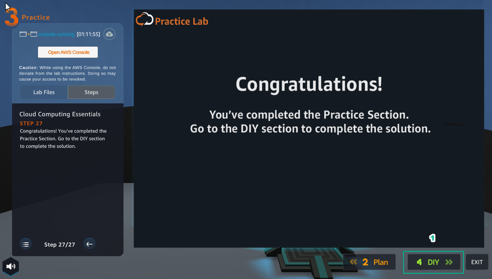
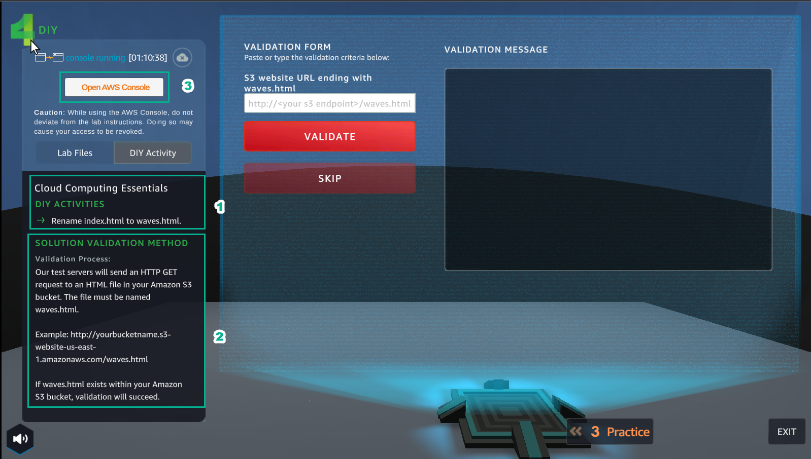
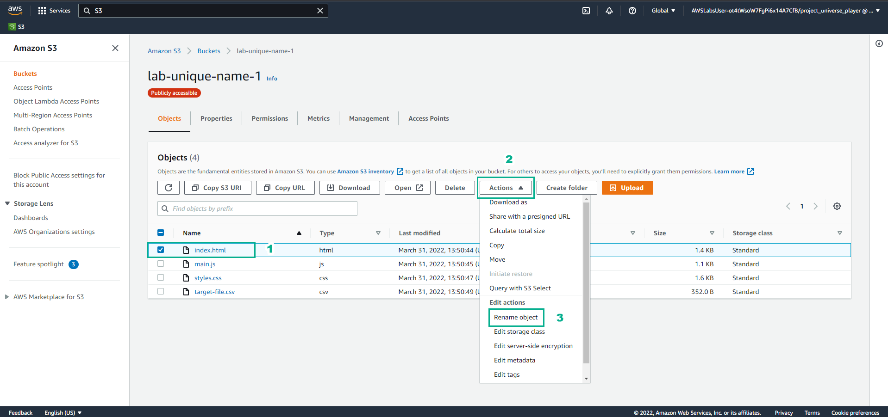
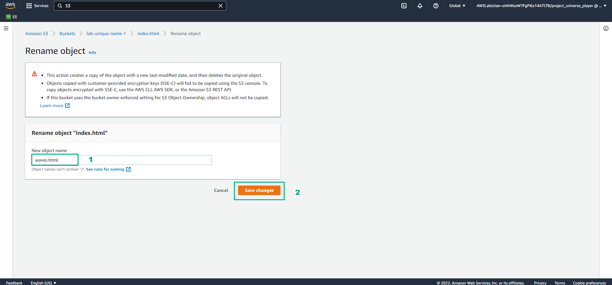
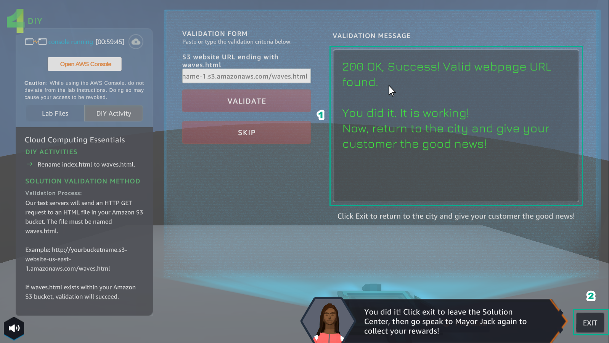
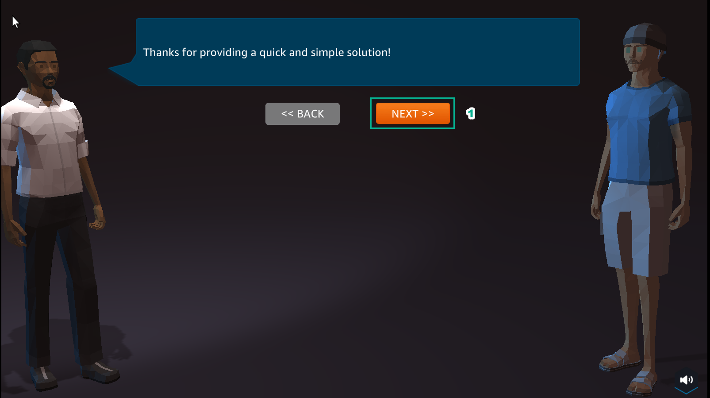

DIY
====================

INFO

After completing the lab, the player does DIY

1. In the Practice interface

 - Select DIY

2. In the DIY interface

- Read DIY ACTIVITIES

- Read SOLUTION VALIDATION METHOD

3. In the AWS Console interface

- Find S3

- Select S3

.. image:: pictures/94.png
   :align: center
   :width: 700px

4. In the Amazon S3 interface

- Select Buckets

- Select lab-unique-name-1

- Select index.html

- Select Actions

- Select Rename object

5. In the Rename object interface

- Change index.html to waves.html

- Select Save changes

6. In the Amazon S3 interface

- View the result of renaming object

- Select waves.html

.. image:: pictures/97.png
   :align: center
   :width: 700px

7. In the wave.html interface

- Select Properties

- View Object URL

- Copy Object URL

.. image:: pictures/98.png
   :align: center
   :width: 700px

8. In the DIY interface

- Paste Object URL into VALIDATION FORM

- Select VALIDATE

.. image:: pictures/99.png
   :align: center
   :width: 700px

9. In the DIY interface

- After selecting VALIDATE, VALIDATION MESSAGE appears 200 OK. Succcess!…

- Select EXIT to exit

10. In the city interface

- Select ASSIGNMENTS

- Select COLLECT

.. image:: pictures/101.png
   :align: center
   :width: 700px

11. Select NEXT

12. Select COLLECT

.. image:: pictures/103.png
   :align: center
   :width: 700px

13. Congratulations to the player receiving the reward

.. image:: pictures/104.png
   :align: center
   :width: 700px
