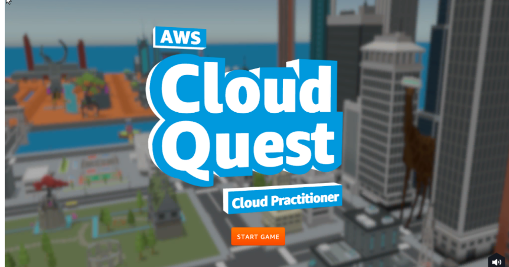

Introduction
====================

Overview
---------------

AWS Cloud Quest: Cloud Practitioner
Overview
AWS Cloud Quest is the first and only role-playing game that helps you build on-demand AWS Cloud skills.
Collect gems and earn points as you build real solutions inside a live AWS environment.

Content
Assignment 1 - Static Web Hosting

Assignment 2 - Launch one EC2 Instance

Assignment 3 - Connect to an EC2 Instance

Assignment 4 - Internet Access for VPC Resources

Assignment 5 - AWS Pricing Calculator

Assignment 6 - Connecting Amazon VPCs

Assignment 7 - Database

Assignment 8 - Security

Assignment 9 - File Systems

Assignment 10 - NoSQL Database

Assignment 11 - Scaling

Assignment 12 - Highly Available Architecture
