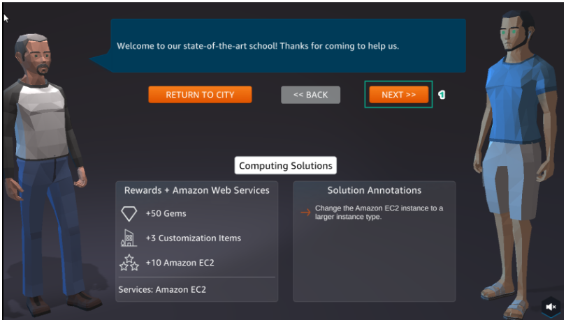
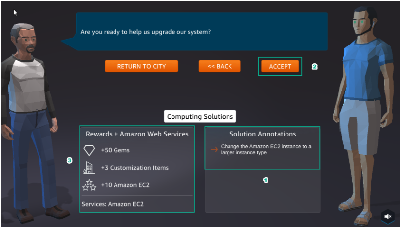
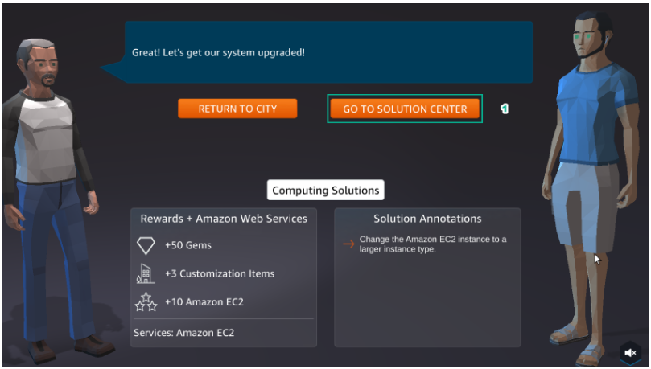
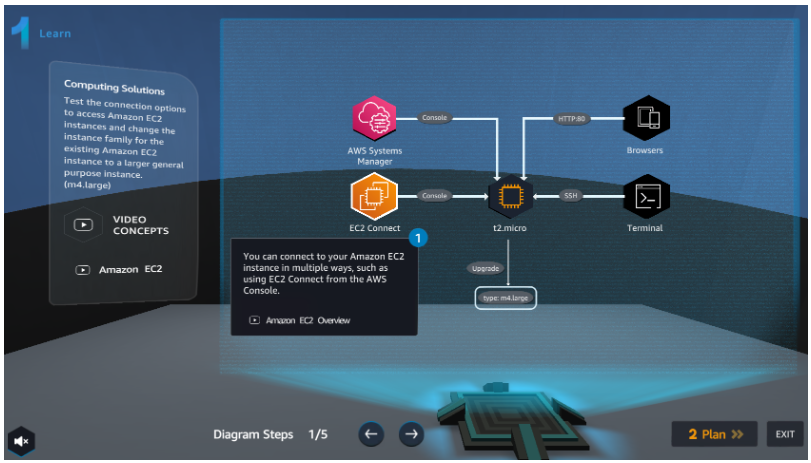

Learn.rst
=================================

1.After entering the Learn interface, select Amazon EC2 Overview

.. image:: pictures/picturesroute_and_go.png
   :align: center
   :width: 700px

2.Select *NEXT*

3.Read *Computing Solutions* and select *ACCEPT*.

4.Select GO TO *SOLUTION CENTER*.

5.Getting Started *Learn*

