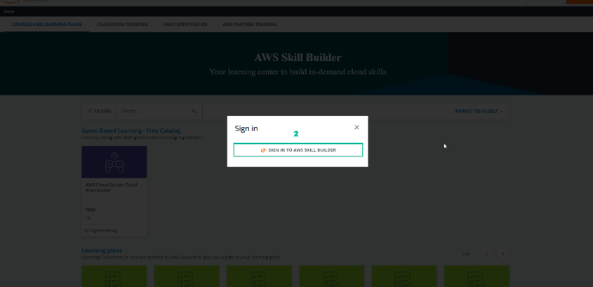
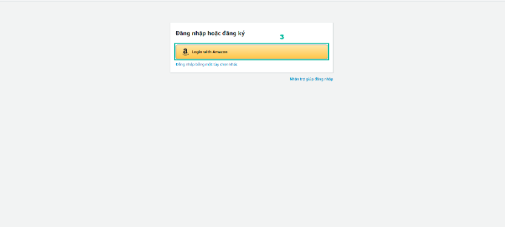
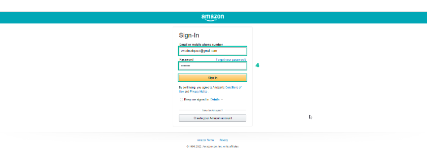
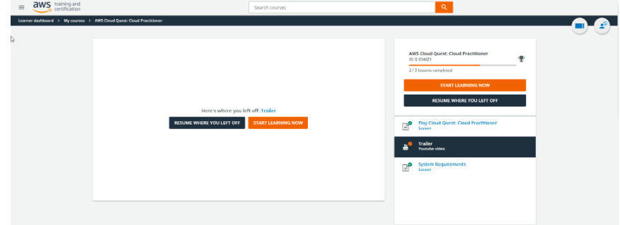
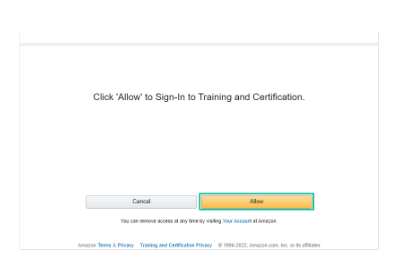

Login to AWS Cloud Quest: Cloud Practitioner with Amazon account
====================

There are 4 options for logging into AWS Training and Certification:

.Login with Amazon

.AWS Partner

.Organization SSO

.Amazon Employee

note!
This lab uses the Login with Amazon login method.

Steps to sign in to AWS Training and Certification

Go to AWS Skill Builder
Select SIGN IN TO AWS SKILL BUILDER

3.The AWS Training and Certification login interface appears, select Login with Amazon

4.Amazon login page appears:
. Enter Email or mobile phone number
. Enter Password
. Then, select Sign-in

4.After logging in, the AWS Training and Certification interface appears.

note!
Note: During the login process, as shown in the picture, select Allow

