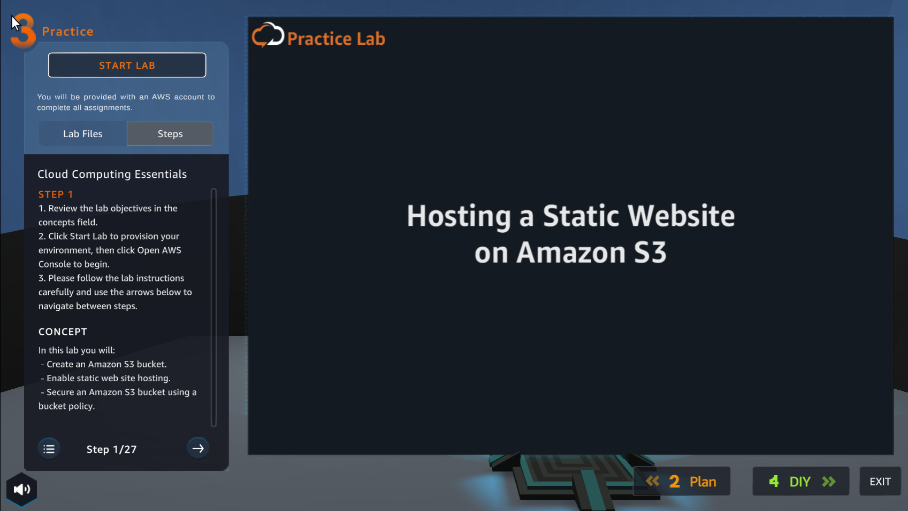
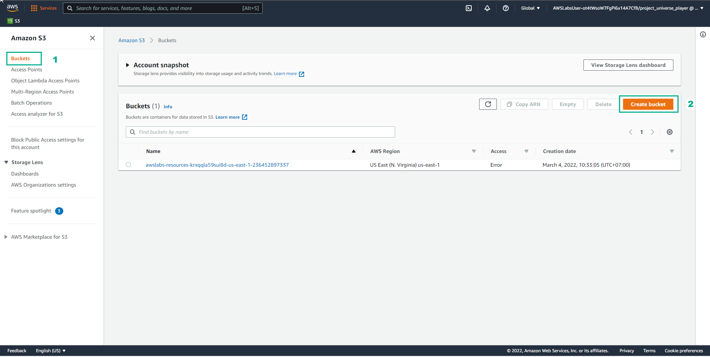
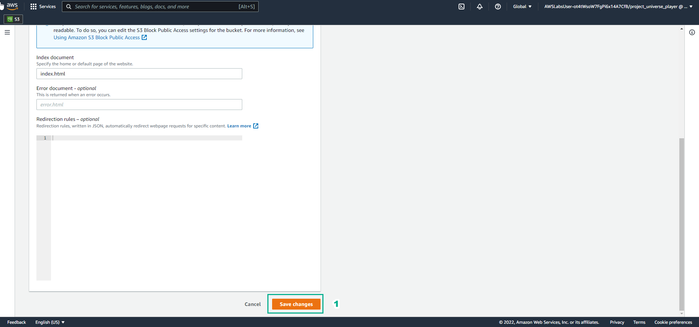
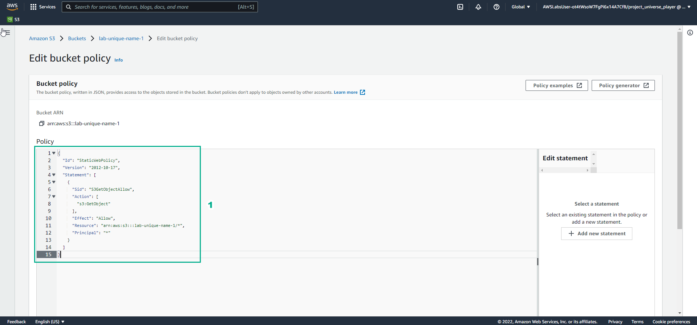
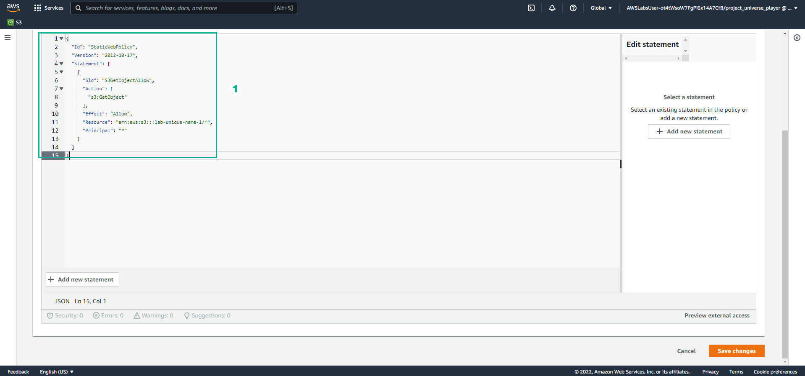

Practice
====================

INFO

After watching Plan, the player prepares for Practice

1. In the Practice interface

- Read step 1 of Cloud Computing Essentials

- Read CONCEPT

- Select START LAB

- Select the arrow to the right to see the next step

2. In the Practice interface

- Read step 2 of Cloud Computing Essentials

- Select Open AWS Console

.. image:: pictures/41.png
   :align: center
   :width: 700px

3. In the Practice interface

- Select Lab Files

- Download labcode.zip to your device

- After downloading, extracting files will be as shown

.. image:: pictures/42.png
   :align: center
   :width: 700px

4. In the Practice interface

- Read step 3 of Cloud Copunting Essentials

- Select the arrow to the right to see the next steps

.. image:: pictures/43.png
   :align: center
   :width: 700px

5. In the Practice* interface

- Read step 4 of Cloud Computing Essentials

- Read CONCEPT

- Select the arrow to the right to see the next steps

.. image:: pictures/44.png
   :align: center
   :width: 700px

6. In the Amazon S3 interface

- Find S3

- Select S3

.. image:: pictures/45.png
   :align: center
   :width: 700px

7. In the Practice interface

- Read step 5 of Cloud Computing Essentials

- Read CONCEPT

- Select the arrow to the right to see the next steps

8. In the Amazon S3 interface

- Select Buckets

- Select Create bucket

9. In the Practice interface

- Read step 6 of Cloud Computing Essentials

- Read CONCEPT

- Select the arrow to the right to see the next steps

10. In the Create bucket interface

- Bucket name, enter lab-unique-name-1

- AWS Region, enter US East (N. Virginia) us-east-1

note!
The bucket name is unique, once the name has been set, it cannot be reset

.. image:: pictures/49.png
   :align: center
   :width: 700px

11. In the Practice interface

- Read step 7 of Cloud Computing Essentials

- Select the arrow to the right to see the next steps

12. In Object Ownership

- Select ACLs enabled

- Select Object writer

.. image:: pictures/51.png
   :align: center
   :width: 700px

13. In the Practice interface

- Read step 8 of Cloud Computing Essentials

- Read CONCEPT

- Select the arrow to the right to see the next steps

.. image:: pictures/52.png
   :align: center
   :width: 700px

14. In the Amazon S3 interface

- Uncheck Block all public access

- Select I acknowledge…

15. In the Practice interface

- Read step 9 of Cloud Computing Essentials

- Read CONCEPT

- Select the arrow to the right to see the next steps

.. image:: pictures/54.png
   :align: center
   :width: 700px

16. In the Amazon S3 interface

- In the Default encryption section, select Enable

- Select **Amazon S3-managed keys (SSE-S3)

- Select Create bucket

.. image:: pictures/55.png
   :align: center
   :width: 700px

17. In the Practice interface

- Read step 10 of Cloud Computing Essentials

- Read CONCEPT

- Select the arrow to the right to see the next steps

.. image:: pictures/56.png
   :align: center
   :width: 700px

18. In the Amazon S3 interface

- Select View details

.. image:: pictures/57.png
   :align: center
   :width: 700px

19. In the Practice interface

- Read step 11 of Cloud Computing Essentials

- Read CONCEPT

- Select the arrow to the right to see the next steps

20. In the Amaozon S3 interface

- Select Upload

.. image:: pictures/59.png
   :align: center
   :width: 700px

21. In the Practice interface

- Read step 12 of Cloud Computing Essentials

- Select the arrow to the right to see the next steps

.. image:: pictures/60.png
   :align: center
   :width: 700px

22. In the Amazon S3 interface
 - Select Add files

- Select uploaded files extracted from labcode.zip

- Select Upload

.. image:: pictures/61.png
   :align: center
   :width: 700px

23. In the Practice interface

- Read step 13 of Cloud Computing Essentials

- Read CONCEPT

- Select the arrow to the right to see the next steps

.. image:: pictures/62.png
   :align: center
   :width: 700px

24. In the Amazon S3 interface

- View successfully uploaded files

- Select Close

.. image:: pictures/63.png
   :align: center
   :width: 700px

25. In the Practice interface

- Read step 14 of Cloud Computing Essentials

- Select the arrow to the right to see the next steps

26. In the Amazon S3 interface

- Select and view files

- Select Actions

- View the Edit actions

27. In the Practice interface

- Read step 15 of Cloud Computing Essentials

- Read CONCEPT

- Select the arrow to the right to see the next steps

28. In the Amazon S3 interface

- Select Properties

.. image:: pictures/67.png
   :align: center
   :width: 700px

29. In the Practice interface

- Read step 16 of Cloud Computing Essentials

- Bury arrow to the right to see next steps

.. image:: pictures/68.png
   :align: center
   :width: 700px

30. In the Amazon S3 interface

- Select Edit

31. In the Practice interface

- Read step 17 of Cloud Computing Essentials

- Read CONCEPT

- Select the arrow to the right to see the next steps

.. image:: pictures/70.png
   :align: center
   :width: 700px

32. In the interface Edit static website hosting

- Select Enable

- Select Host a static website

- In Index document, enter index.html

.. image:: pictures/71.png
   :align: center
   :width: 700px

33. In the Practice interface

- Read step 18 of Cloud Computing Essentials

- Select the arrow to the right to see the next steps

.. image:: pictures/72.png
   :align: center
   :width: 700px

33. In the Amazon S3 interface

- Select Save changes

.. image:: pictures/73.png
   :align: center
   :width: 700px

34. In the Practice interface

- Read step 19 of Cloud Computing Essentials

- Read CONCEPT

- Select the arrow to the right to see the next steps

35. In the Amazon S3 interface

- Select Permissions

- View Block all public access

- Select Edit

.. image:: pictures/75.png
   :align: center
   :width: 700px

36. In the Practice interface

- Read step 20 of Cloud Computing Essentials

- Read CONCEPT

- Select the arrow to the right to see the next steps

.. image:: pictures/76.png
   :align: center
   :width: 700px

37. In the Edit bucket policy interface

- Copy Bucket RNA

- Remove Policy

38. In the Practice interface

- Read step 21 of Cloud Computing Essentials

- Select the arrow to the right to see the next steps

.. image:: pictures/78.png
   :align: center
   :width: 700px

39. In the Edit bucket policy interface

- Open the file policy.text

- Replace Bucket ARN into Resource

- Copy the contents of the file policy.txt

- Paste in Policy

.. image:: pictures/79.png
   :align: center
   :width: 700px

40. In the Practice interface

- Read step 22 of Cloud Computing Essentials

- Select the arrow to the right to see the next steps

41. In the Amazon S3 interface

- Copy the contents of the file policy.txt

.. image:: pictures/81.png
   :align: center
   :width: 700px

42. In the Practice interface

- Read step 23 of Cloud Computing Essentials

- Select the arrow to the right to see the next steps

43. In the Amazon S3 interface

- Select Save changes

44. In the Practice interface

- Read step 24 of Cloud Computing Essentials

- Read CONCEPT

- Select the arrow to the right to see the next steps

.. image:: pictures/84.png
   :align: center
   :width: 700px

45. ​​In the Amazon S3 interface

- Select Properties

.. image:: pictures/85.png
   :align: center
   :width: 700px

46. In the Practice interface

- Read step 25 of Cloud Computing Essentials

- Select the arrow to the right to see the next steps

.. image:: pictures/86.png
   :align: center
   :width: 700px

47. In the Amazon S interface

- See Hosting type

- Copy Bucket website endpoint

.. image:: pictures/87.png
   :align: center
   :width: 700px

48. In the Practice interface

- Read step 26 of Cloud Computing Essentials

- Select the arrow to the right to see the next steps

.. image:: pictures/88.png
   :align: center
   :width: 700px

49. Open a browser

- Paste Bucket website endpoint into the browser

- Select Enter

- View results

.. image:: pictures/89.png
   :align: center
   :width: 700px

50. Congratulations to the player on completing the lab

.. image:: pictures/90.png
   :align: center
   :width: 700px

