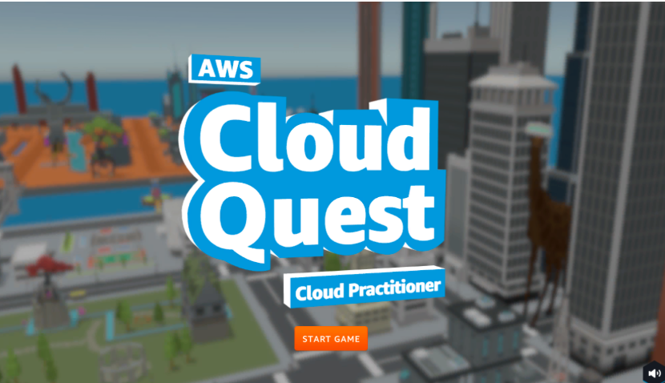

Welcome to AWS Cloud Quest: Cloud Practitioner Documentation!
=============================================================

Group 4
=======

*Members:*

Alven garque

Rodney patinio

.. note::

   This training resource has been prepared and is maintained by our group to support learning through 
   *AWS Cloud Quest: Cloud Practitioner*. We actively update the content to reflect the latest AWS 
   best practices and to ensure it remains accurate, helpful, and relevant for new learners.

Contents
--------

.. toctree::
   :maxdepth: 2
   :caption: Table of Contents

   Introduction
   Preparation steps
   Getting acquainted with AWS Cloud Quest
   A1 - Static web hosting
   A2 - Launch an Amazon EC2 Instance
   A3 - Connect to an EC2 Instance
